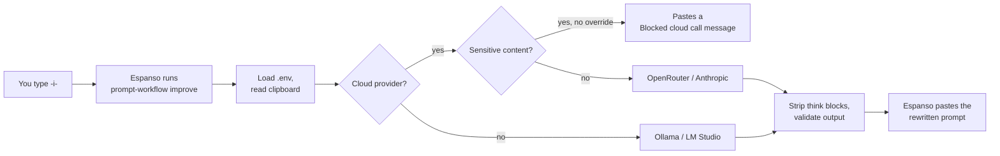

# Espanso Prompt Rewriter

**Type a trigger, get a well-structured LLM prompt.** Copy a rough draft, type `-i-`
anywhere, and [Espanso](https://espanso.org/) replaces it with a precise, sectioned prompt
rewritten by a local or cloud model.

[](https://github.com/vlastimilbures/espanso-prompt-rewriter/actions/workflows/test.yml)
[](https://github.com/vlastimilbures/espanso-prompt-rewriter/actions/workflows/secret-scan.yml)
[](https://github.com/vlastimilbures/espanso-prompt-rewriter/releases)
[](LICENSE)
<br>
[](pyproject.toml)
[](#requirements)
[](https://github.com/astral-sh/uv)
[](https://github.com/astral-sh/ruff)
[](https://mypy-lang.org/)
[](https://github.com/pre-commit/pre-commit)

One small Python CLI sits behind every trigger. It reads your clipboard, checks the draft for
sensitive content before anything leaves your machine, asks the model to rewrite it into a fixed
template, and pastes the result back — or a readable `[prompt-workflow: …]` message if something
went wrong. It works the same way on macOS and Windows, with
[OpenRouter](https://openrouter.ai), [Anthropic](https://www.anthropic.com),
[Ollama](https://ollama.com) or [LM Studio](https://lmstudio.ai).

<details>
<summary><b>Example:</b> a one-line draft and what <code>-i-</code> turns it into</summary>

Draft on the clipboard:

```text
write a short board update on why customer churn went up last quarter, use the attached churn dashboard export
```

Pasted in its place (real output, default model, no persona configured):

```text
<CONTEXT>
I need to write a short board update explaining the increase in customer churn during the previous quarter, based on the provided churn dashboard export.
</CONTEXT>

<GOAL>
A clear, concise board update explaining the root causes of the rise in customer churn last quarter.
</GOAL>

<INSTRUCTIONS>
1/ Plan the task thoroughly, list any assumptions and open questions, and validate the plan with me before executing.
2/ Load and validate all inputs. If anything is missing, ambiguous, or contradictory, ask me up to 5 targeted questions before drafting.
3/ Analyze the churn dashboard export to identify key metrics, trends, and primary drivers behind the churn increase.
4/ Synthesize the findings into a concise narrative structure suitable for a board audience, highlighting key data points and context.
5/ Spin up an independent agent with SaaS churn and retention domain knowledge and perform a critical review, check for errors, and ensure the output is complete and accurate, review formatting and clarity, and ensure the output is well structured and easy to read; summarize all issues and improvement points, validate them with me before implementing any changes.
6/ Flag material judgment calls or trade-offs and let me decide.
</INSTRUCTIONS>

<CONSTRAINTS>
- Keep the update short and scannable for board members.
- Maintain an objective, professional tone.
- Base all claims strictly on the provided churn dashboard export.
- Out of scope: strategic recommendations or mitigation plans unless directly evidenced in the data.
</CONSTRAINTS>

<INPUTS>
Churn dashboard export [REVIEW: attach or paste the dashboard export data]
</INPUTS>

<OUTPUTS>
structured .md, well formatted with clear headings/subheadings
</OUTPUTS>
```

The two choices are made independently. Analysing an export and then writing it up is
multi-step work, so step 1 is "plan first"; the board audience selected the independent-review
step. A quick note to yourself would get "execute now" and a self-review checklist instead.

</details>

## Contents

- ✨ [Features](#features)
- ⚙️ [How it works](#how-it-works)
- 📋 [Requirements](#requirements)
- 🚀 [Quick start](#quick-start)
- ⌨️ [Usage](#usage)
- 🔧 [Configuration](#configuration)
- 🧩 [Profiles and persona](#profiles-and-persona)
- 🔒 [Privacy and data protection](#privacy-and-data-protection)
- 📊 [Model benchmark](#model-benchmark)
- 🩺 [Troubleshooting](#troubleshooting)
- 🗂️ [Project structure](#project-structure)
- 🛠️ [Development](#development)
- 🤝 [Contributing, security, license](#contributing-security-license)

## Features

- 🧱 **Golden-template rewrite.** The `default` profile turns any draft into
  `CONTEXT / GOAL / INSTRUCTIONS / CONSTRAINTS / INPUTS / OUTPUTS`, and picks the planning and
  review steps from the task's complexity and audience.
- 🧠 **Two tiers.** `-i-` answers in about 2 seconds; `-ip-` hands hard, multi-part
  drafts to a reasoning model for a more rigorous rewrite in about 5-8 seconds.
- 🔌 **Four providers, one interface.** OpenRouter (default), Anthropic, Ollama and LM Studio.
  Switching is one setting.
- 🛡️ **Data-protection gate.** Before any cloud call the draft is scanned for payment cards,
  national IDs, emails, API keys, tokens, passwords, private keys, confidentiality labels and
  your own patterns; matches are blocked unless you explicitly override.
- 🙋 **Your persona, once.** Set `PROMPT_PERSONA` and every rewrite (and the `-p-` snippet) opens
  with your role.
- 🧯 **Never a blank expansion.** Errors arrive inline as `[prompt-workflow: …]`, because Espanso
  cannot show stderr or exit codes.
- 🧹 **Reasoning stripped.** `<think>…</think>` blocks from reasoning models never reach your text.
- 📊 **Benchmarked model choice.** A bundled benchmark scores models on template fidelity,
  latency and real cost.

## How it works



Espanso starts the CLI as a GUI subprocess without your shell's `PATH` or environment. So the
install scripts write the CLI's absolute path into the match files, and the CLI reads its
settings from the `.env` in the repository it was installed from (see
[Configuration](#configuration)).

## Requirements

- macOS or Windows with [Espanso](https://espanso.org/install/) installed and running. Espanso
  also runs on Linux, but the install scripts don't cover it yet (see [Quick start](#quick-start)).
- Python 3.12+ and [uv](https://docs.astral.sh/uv/getting-started/installation/)
- For the default `-i-` trigger: an [OpenRouter API key](https://openrouter.ai/keys).
  For fully local use instead: [Ollama](https://ollama.com) or [LM Studio](https://lmstudio.ai).

## Quick start

```bash
git clone https://github.com/vlastimilbures/espanso-prompt-rewriter.git
cd espanso-prompt-rewriter
cp .env.example .env    # set OPENROUTER_API_KEY, optionally PROMPT_PERSONA
chmod 600 .env          # macOS/Linux: the file holds your API key
```

Keep `.env` in the repository folder: the triggers load it from there. Then install the CLI and
deploy the Espanso match files:

```bash
./scripts/install_macos.sh      # macOS
.\scripts\install_windows.ps1   # Windows (PowerShell)
```

The installer runs `uv tool install`, writes the absolute CLI path into the match files, and
restarts Espanso. Before replacing a file you changed, it saves a `.bak-<timestamp>` copy next to
it. It leaves your Espanso `config/default.yml` alone; pass `--with-config` (`-WithConfig` on
Windows) to also deploy [ours](espanso/config/default.yml). The Windows script runs on Windows
PowerShell 5.1 and PowerShell 7; you may first need
`Set-ExecutionPolicy -Scope CurrentUser RemoteSigned`.

Now copy a rough draft, type `-i-` in any text field, and wait a couple of seconds.

<details>
<summary>Linux or manual install</summary>

```bash
uv tool install --editable .
```

Copy `espanso/match/*.yml` into `$(espanso path config)/match/`, replacing `__PROMPT_WORKFLOW__`
with the output of `echo "$(uv tool dir --bin)/prompt-workflow"`, then run `espanso restart`.

</details>

## Usage

### Triggers

| Trigger           | What it does                                                 | Provider   | Profile   |
|-------------------|--------------------------------------------------------------|------------|-----------|
| `-i-`             | Rewrites the clipboard into the golden template              | OpenRouter | `default` |
| `-ip-`            | Same rewrite on the pro tier (reasoning model, slower)       | OpenRouter | `default` |
| `-if-`            | Same rewrite; a popup picks model, effort, tokens, timeout   | OpenRouter | `default` |
| `-il-`            | General prompt improvement, fully local                      | Ollama     | `general` |
| `-ilm-`           | General prompt improvement, fully local                      | LM Studio  | `general` |
| `-ic-`            | General improvement via Claude (commented out by default)    | Anthropic  | `general` |
| `-p-`             | Empty golden template to fill in, opening with your persona  | —          | —         |
| `-prompt-`        | Form: role, objective, context, constraints, output          | —          | —         |
| `-risk-`          | Enterprise-risk analysis prompt scaffold                     | —          | —         |

The improve triggers (`-i-`, `-ip-`, `-if-`, `-il-`, `-ilm-`) read your current clipboard. Cloud
triggers pass through the [data-protection gate](#privacy-and-data-protection) first. To enable `-ic-`,
uncomment it in [`espanso/match/prompts-llm.yml`](espanso/match/prompts-llm.yml) and re-run the
installer.

`-if-` opens an Espanso form with four dropdowns before the rewrite runs: the model
(each entry is `model@endpoint`, the OpenRouter slug plus its endpoint pin; `@auto` leaves
routing to OpenRouter), reasoning effort, max output tokens and timeout. `default` in any list
keeps the pro-tier setting (`OPENROUTER_PRO_*`). Edit the lists in
[`espanso/match/prompts-llm.yml`](espanso/match/prompts-llm.yml) and re-run the installer; the
tests reject any value the CLI would not accept. Two things to know:

- Many reasoning models count thinking tokens against the max-tokens cap, so pair `high` effort
  with `8000` or more, or the rewrite can come back cut short.
- Espanso waits for the command, and other triggers do not expand until it finishes. A `high`
  effort rewrite on `openai/gpt-6-luna` took about 23 s.

### CLI

The same CLI works on its own, which is handy for trying profiles and models:

```bash
echo "summarise the Q3 incident log for the ops team" | prompt-workflow improve --source stdin
prompt-workflow improve --provider ollama --profile general --source clipboard
prompt-workflow improve --model openai/gpt-4.1-nano --source argument --text "your draft"
prompt-workflow improve --tier pro --source clipboard   # the reasoning model behind -ip-
prompt-workflow persona          # prints PROMPT_PERSONA (used by -p-)
```

| Option       | Default                     | Meaning                                         |
|--------------|-----------------------------|-------------------------------------------------|
| `--provider` | `PROMPT_PROVIDER`           | `ollama`, `lmstudio`, `openrouter`, `anthropic` |
| `--profile`  | `PROMPT_PROFILE`            | `default`, `general`, or any file in `prompts/` |
| `--model`    | provider's configured model | Override the model; `model@endpoint` also pins the OpenRouter endpoint (`@auto` unpins) |
| `--tier`     | `standard`                  | `pro` uses the `OPENROUTER_PRO_*` settings      |
| `--effort`   | tier's setting              | `none`, `minimal`, `low`, `medium`, `high`      |
| `--max-tokens` | tier's setting            | Output cap for this call                        |
| `--timeout`  | tier's setting              | Request timeout in seconds for this call        |
| `--source`   | `clipboard`                 | `clipboard`, `stdin` or `argument`              |
| `--text`     | —                           | The draft, with `--source argument`             |
| `--copy`     | off                         | Also copy the result to the clipboard           |

Output never has a trailing newline, and every failure is printed as `[prompt-workflow: …]` with
exit code 0, so Espanso always has something to paste. Drafts over 50,000 characters are refused
(an accidental copy of a log or document should not go to the cloud). If the model stops at its
max-tokens cap, the partial rewrite is pasted with
`[prompt-workflow: output truncated at max tokens]` at the end.

## Configuration

All settings are environment variables, usually set in `.env` (see
[`.env.example`](.env.example)). Real environment variables take precedence over `.env`.

The CLI reads the first `.env` it finds in:

1. the file named by `PROMPT_WORKFLOW_ENV`, if set;
2. the repository the CLI was installed from (the installers use an editable install);
3. `~/.config/prompt-workflow/.env` (`%APPDATA%\prompt-workflow\.env` on Windows).

It never reads a `.env` from the current directory, so running the CLI inside some other
project cannot change its endpoint or switch off the gate. Values may be quoted, and an unquoted
value may be followed by a ` # comment`. Quote a value that itself contains ` #`.

| Variable                     | Default                        | Purpose                                                   |
|------------------------------|--------------------------------|-----------------------------------------------------------|
| `PROMPT_PROVIDER`            | `openrouter`                   | Provider when `--provider` is not given                   |
| `PROMPT_PROFILE`             | `default`                      | Profile when `--profile` is not given                     |
| `PROMPT_PERSONA`             | *(empty)*                      | Your first-person role, see [persona](#profiles-and-persona) |
| `PROMPT_TIMEOUT_SECONDS`     | `30`                           | Request timeout                                           |
| `PROMPT_TEMPERATURE`         | `0.2`                          | Kept low so fixed template wording survives               |
| `OPENROUTER_API_KEY`         | —                              | Required for OpenRouter                                   |
| `OPENROUTER_MODEL`           | `google/gemini-3.5-flash-lite` | See [benchmark](#model-benchmark)                         |
| `OPENROUTER_PROVIDER`        | `google-ai-studio/flex`        | Pin a serving endpoint; empty = OpenRouter's own routing  |
| `OPENROUTER_REASONING_EFFORT` | `minimal`                     | `none`…`high`; empty omits it (models without the control) |
| `OPENROUTER_ALLOW_FALLBACKS` | `true`                         | `false` makes the pin binding                             |
| `OPENROUTER_MAX_TOKENS`      | `2400`                         | Output cap (cost control)                                 |
| `OPENROUTER_BASE_URL`        | `https://openrouter.ai/api/v1` |                                                           |
| `OPENROUTER_PRO_MODEL`       | `openai/gpt-6-luna`            | Model for `--tier pro` / `-ip-`                   |
| `OPENROUTER_PRO_PROVIDER`    | `openai`                       | Endpoint pin for the pro tier                             |
| `OPENROUTER_PRO_REASONING_EFFORT` | `low`                     | Reasoning effort for the pro tier                         |
| `PROMPT_PRO_TIMEOUT_SECONDS` | `60`                           | Request timeout for the pro tier                          |
| `ANTHROPIC_API_KEY`          | —                              | Required for Anthropic                                    |
| `ANTHROPIC_MODEL`            | `claude-sonnet-5`              |                                                           |
| `ANTHROPIC_MAX_TOKENS`       | `2400`                         |                                                           |
| `ANTHROPIC_BASE_URL`         | `https://api.anthropic.com`    |                                                           |
| `OLLAMA_BASE_URL`            | `http://localhost:11434`       |                                                           |
| `OLLAMA_MODEL`               | `qwen3:8b`                     |                                                           |
| `OLLAMA_THINK`               | `false`                        | Keep reasoning off for thinking models                    |
| `LMSTUDIO_BASE_URL`          | `http://localhost:1234/v1`     |                                                           |
| `LMSTUDIO_MODEL`             | `local-model`                  |                                                           |
| `ALLOW_CLOUD_OVERRIDE`       | `false`                        | `true` lets flagged drafts reach cloud providers          |
| `PROMPT_EXTRA_PATTERNS`      | *(empty)*                      | Your own `;`-separated regexes for the gate               |
| `PROMPT_WORKFLOW_ENV`        | *(unset)*                      | Path of the `.env` to load (real environment only)        |

## Profiles and persona

A profile is a system prompt in [`src/prompt_workflow/prompts/`](src/prompt_workflow/prompts/):

- **`default`** rewrites the draft into the golden template (the same one the static `-p-`
  snippet gives you). Step 1 is "plan first" for multi-step or ambiguous work, otherwise
  "execute, but state assumptions". The review step is an independent reviewer when the result
  goes to a board, regulator, customer or other high-stakes audience, otherwise a self-review
  checklist. `CONSTRAINTS` lists the rules the result must respect (length, tone, deadline,
  format, standards, data limits), ending with an "Out of scope:" line. The prompt itself is
  organised in lowercase XML sections (`<section_rules>`, `<step>`, `<decision_rule>`,
  `<example>`…), which keeps its own scaffolding visibly apart from the uppercase sections the
  model must write.
- **`general`** is a lighter "make this prompt precise" rewrite, used by the local triggers.

Drop another `*.md` file into that folder and it becomes a profile. See
[CONTRIBUTING.md](CONTRIBUTING.md#add-a-profile).

**Persona.** Set `PROMPT_PERSONA` to a first-person sentence, for example
`PROMPT_PERSONA="I am working as a Head of Data at Example Corp."`. The `default` rewrite then
opens `CONTEXT` with it, unless the draft names a different role, and `-p-` inserts it for you.
Left empty, the rewrite uses only a role the draft itself states and never guesses one.

## Privacy and data protection

> [!IMPORTANT]
> Cloud triggers send your clipboard to a third-party API. Use them only where your organisation's
> policy allows. For sensitive work, set `PROMPT_PROVIDER=ollama` (or use `-il-`) and
> nothing leaves your machine.

Every OpenRouter or Anthropic call first runs through a regex gate
([`redaction.py`](src/prompt_workflow/redaction.py)). It blocks drafts containing:

- payment card numbers (Luhn-checked) and email addresses
- API keys (OpenRouter, Anthropic, OpenAI, Stripe, GitHub, Slack, Google, xAI, AWS), JWTs,
  bearer tokens, PEM private keys, `user:password@` URLs and `password=…`-style assignments
- confidentiality labels such as *confidential*, *restricted*, *internal only*, *customer data*
- Vietnamese national ID formats (12-digit, and 9-digit next to an ID keyword)
- your own patterns from `PROMPT_EXTRA_PATTERNS`, for example
  `PROMPT_EXTRA_PATTERNS="project[- ]falcon;CUST-\d{6}"` (case-insensitive; reported as
  `custom_1`, `custom_2`, … so the pattern itself never appears in the message)

> [!WARNING]
> The gate is a heuristic safety net, not a compliance control. It misses things (names,
> addresses, most countries' ID formats, look-alike letters from other alphabets) and sometimes
> flags harmless text.

The draft is also scanned in a normalised form, so no-break or zero-width spaces, soft hyphens and
fullwidth digits cannot split a card number or key.

A blocked draft pastes `[prompt-workflow: Blocked cloud call. Sensitive content detected: …]`
instead of calling the API. `ALLOW_CLOUD_OVERRIDE=true` disables the block. No code path builds a
cloud provider without the gate. Cloud base URLs must be `https://` (plain `http` only to
`localhost`), so a key is never sent in clear text. Keys stay in `.env`, which is gitignored and
never logged.

## Model benchmark

The rewrite is only useful if the template comes back intact, so the default model was chosen
with [`scripts/bench_models.py`](scripts/bench_models.py) rather than by taste. It sends 8 drafts
that cross two independent decisions — *plan first or execute now* (task complexity) and
*independent or self review* (audience and consequence) — three runs each, and scores every
response mechanically: all six sections present and correctly closed, mandatory steps verbatim,
`1/ 2/ 3/` numbering, both branch choices right, no third-person context, no degeneration. Cost
and token counts come from OpenRouter's own usage data. Each model is given as
`model@endpoint~effort`: the endpoint is pinned with fallbacks off, because the same model on
another host can differ several-fold in latency and cost, and `~effort` sets the reasoning
effort. The report splits passes by draft, so a draft every model fails shows up as a prompt
problem rather than a model one.

**Result (2026-09-29, 24 calls per setup, current prompt):**

| Setup | Tier | Pass | p50 | p95 | $ per rewrite |
|-------|------|------|-----|-----|---------------|
| `google/gemini-3.5-flash-lite` @ `google-ai-studio/flex`, effort `minimal` | standard (default) | 24/24 | 2.0 s | 2.6 s | 0.0009 |
| `google/gemini-3.1-flash-lite` @ `google-ai-studio/flex`, effort `minimal` | standard | 24/24 | 2.2 s | 2.8 s | 0.0006 |
| `google/gemini-3.5-flash-lite` @ `google-vertex/global`, effort `minimal` | standard | 24/24 | 2.4 s | 2.9 s | 0.0018 |
| `google/gemini-2.5-flash-lite` @ `google-ai-studio/flex` (previous default) | standard | 14/24 | 2.1 s | 3.0 s | 0.0002 |
| `openai/gpt-6-luna` @ `openai`, effort `low` | pro (default) | 24/24 | 5.4 s | 8.3 s | 0.0004 |
| `google/gemini-3.8-flash` @ `google-ai-studio`, effort `low` | pro | 24/24 | 3.1 s | 5.4 s | 0.0036 |

Pass rate alone did not pick the pro model. Reading the outputs side by side, `gpt-6-luna`
wrote the most rigorous prompts: claims tied to sources, targeted `[REVIEW: …]` flags, and it
never invented anything. `gemini-3.8-flash` was faster but cited regulatory circulars the draft
never mentioned in 3 of 24 outputs. `inception/mercury-2.5` scored 10/24 and was dropped.

> [!NOTE]
> OpenRouter's models, endpoints and prices change quickly, so re-run the benchmark before
> relying on these results.

```bash
uv run python scripts/bench_models.py --models google/gemini-3.5-flash-lite@google-ai-studio/flex~minimal --runs 3
uv run python scripts/bench_models.py --system-prompt-file candidate.md   # A/B a prompt change
```

## Troubleshooting

| Symptom | Fix |
|---------|-----|
| Trigger does not expand | Run `espanso status`, check the match files are in `$(espanso path config)/match`, re-run the installer. |
| `[prompt-workflow: OPENROUTER_API_KEY is not configured]` | The key is missing from `.env`, or `.env` is not in one of the [places the CLI looks](#configuration). |
| `[prompt-workflow: OpenRouter returned HTTP 401]` | Wrong key. Replace it in `.env`. |
| `[prompt-workflow: Ollama request failed: …]` | Start Ollama (`ollama serve`) and pull the model (`ollama pull qwen3:8b`). |
| `[prompt-workflow: Blocked cloud call. …]` | The [gate](#privacy-and-data-protection) matched. Use a local trigger, or override if policy permits. |
| `[prompt-workflow: Input is too long …]` | The clipboard holds more than 50,000 characters. Copy just the draft. |
| `… output truncated at max tokens]` at the end, or `… used the whole max-tokens budget` | The model hit its output cap, often by spending it on reasoning. Raise `OPENROUTER_MAX_TOKENS`, or pick a larger max tokens (or lower effort) in `-if-`. |
| A `base.yml.bak-…` file appeared in Espanso's `match` folder | Versions before 0.9 deployed `-p-` as `match/base.yml`, the file Espanso creates for your own snippets. The installer backed up that copy and replaced it with `prompts-template.yml`. Older installers overwrote `base.yml` without a backup, so snippets you kept there before first installing this project can only come from your own backups. |
| Expansion is slow | Use a faster model or endpoint (see [benchmark](#model-benchmark)); Espanso waits for the CLI. |
| `[prompt-workflow: … must be an https:// URL]` | A cloud `*_BASE_URL` uses `http`. Switch it to `https`. |
| Reasoning text appears in the output | Set `OLLAMA_THINK=false`. `<think>` blocks are stripped; extend `strip_thinking` in `providers/base.py` for other tag formats. |

For fully local use, pull a model (`ollama pull qwen3:8b`) or load one in LM Studio and enable
its local server, then check it answers: `curl http://localhost:11434/api/tags` or
`curl http://localhost:1234/v1/models`.

## Project structure

```text
espanso-prompt-rewriter/
├── espanso/                      deployed into Espanso by the installers
│   ├── match/
│   │   ├── prompts-llm.yml       -i- -ip- -if- -il- -ilm- (-ic-): call the CLI
│   │   ├── prompts-core.yml      -prompt- -risk-: static snippets and forms
│   │   └── prompts-template.yml  -p-: the empty golden template, opens with your persona
│   └── config/
│       └── default.yml           optional Espanso settings (--with-config / -WithConfig)
├── src/prompt_workflow/          the prompt-workflow CLI
│   ├── cli.py                    improve and persona commands, inline error marker
│   ├── config.py                 Settings from the environment and .env
│   ├── factory.py                make_provider(): the only place providers are built
│   ├── gate.py                   GatedProvider: scans every cloud prompt first
│   ├── redaction.py              the gate's sensitive-content patterns
│   ├── prompt_builder.py         loads profiles, fills in the persona rule
│   ├── prompts/
│   │   ├── default.md            golden-template rewrite (-i-, -ip-, -if-)
│   │   └── general.md            lighter "make this precise" rewrite (local triggers)
│   └── providers/
│       ├── base.py               HTTP call, error mapping, <think> stripping
│       ├── openai_compatible.py  OpenRouter and LM Studio
│       ├── anthropic.py          Anthropic Messages API
│       └── ollama.py             Ollama /api/chat
├── scripts/
│   ├── install_macos.sh          install the CLI and deploy the match files
│   ├── install_windows.ps1       the same for Windows
│   └── bench_models.py           score models on template fidelity, latency, cost
├── tests/                        unit tests, no network (fake_http in conftest.py)
│   ├── test_live.py              opt-in real OpenRouter calls (pytest -m live)
│   └── test_docs.py              README and .env.example list every setting
├── .github/                      CI (tests, gitleaks), Dependabot, issue and PR templates
├── .env.example                  every setting with its default; copy to .env
├── CONTRIBUTING.md               setup, checks, how to add a profile/trigger/provider
├── SECURITY.md                   how to report a gate bypass or other vulnerability
└── CHANGELOG.md                  release notes
```

## Development

```bash
uv sync --extra dev
uv run pytest                 # unit tests, no network
uv run pytest -m live         # opt-in: real OpenRouter calls, needs OPENROUTER_API_KEY
uv run ruff check . && uv run ruff format --check . && uv run mypy
uv run pre-commit install     # same checks on every commit
```

CI runs lint and type checks once, and the tests on macOS, Windows and Linux with Python 3.12 and
3.13. Gitleaks scans every push for secrets.

## Contributing, security, license

- 🤝 Contributions are welcome. Read [CONTRIBUTING.md](CONTRIBUTING.md) first.
- 🔐 Found a way around the data-protection gate, or another vulnerability? Report it privately
  as described in [SECURITY.md](SECURITY.md).
- 📝 Release notes are in [CHANGELOG.md](CHANGELOG.md).
- 📄 Licensed under the [MIT License](LICENSE).

Built on [Espanso](https://espanso.org/), [Typer](https://typer.tiangolo.com/),
[HTTPX](https://www.python-httpx.org/) and [uv](https://docs.astral.sh/uv/), with models served by
[OpenRouter](https://openrouter.ai/), [Anthropic](https://www.anthropic.com/),
[Ollama](https://ollama.com/) and [LM Studio](https://lmstudio.ai/).
