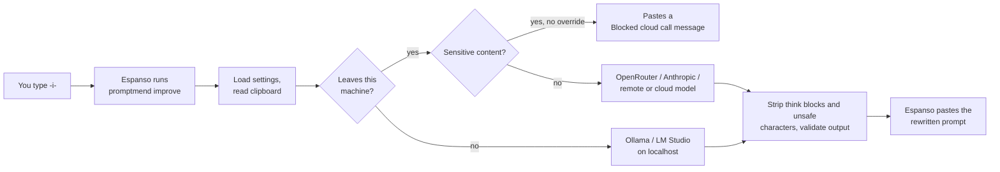
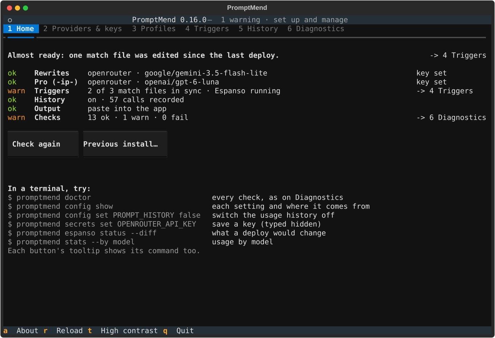

# Espanso Prompt Rewriter

**Type a trigger, get a well-structured LLM prompt.** Copy a rough draft, type `-i-`
anywhere, and [Espanso](https://espanso.org/) replaces it with a precise, sectioned prompt
rewritten by a local or cloud model.

[](https://github.com/vlastimilbures/promptmend/actions/workflows/test.yml)
[](https://github.com/vlastimilbures/promptmend/actions/workflows/secret-scan.yml)
[](https://github.com/vlastimilbures/promptmend/releases)
[](LICENSE)
<br>
[](pyproject.toml)
[](#requirements)
[](https://github.com/astral-sh/uv)
[](https://github.com/astral-sh/ruff)
[](https://mypy-lang.org/)
[](https://github.com/pre-commit/pre-commit)

One small Python CLI sits behind every trigger. It reads your clipboard, checks the draft for
sensitive content before anything leaves your machine, sends it with the rewrite instructions
(including your persona, if you set one, which the gate does not scan; `config validate` and
`doctor` check it) to the model, and pastes the
result back — or a readable `[promptmend: …]` message if something went wrong. See
[What is sent, and to whom](#what-is-sent-and-to-whom). It works the same way on macOS and Windows, with
[OpenRouter](https://openrouter.ai), [Anthropic](https://www.anthropic.com),
[Ollama](https://ollama.com) or [LM Studio](https://lmstudio.ai).

<details>
<summary><b>Example:</b> a one-line draft and what <code>-i-</code> turns it into</summary>

Draft on the clipboard:

```text
write a short board update on why customer churn went up last quarter, use the attached churn dashboard export
```

Pasted in its place (real output of the v0.19.0 prompt on its default model,
`google/gemini-3.5-flash-lite` on `google-ai-studio/flex`, effort `minimal`, no persona
configured, generated 2026-10-06):

```text
<CONTEXT>
I need to write a short board update explaining why customer churn went up last quarter, using the attached churn dashboard export.
</CONTEXT>

<GOAL>
A concise, executive-level board update explaining the drivers of increased customer churn last quarter and the actions being taken.
</GOAL>

<INSTRUCTIONS>
1/ Execute, but state assumptions up front.
2/ Load and validate all inputs. If anything is missing, ambiguous, or contradictory, ask me up to 5 targeted questions before drafting; if step 1 says execute, state your assumption instead and ask only about a gap that blocks the task.
3/ Analyse the churn dashboard export to identify the trends, segments, and main drivers behind the churn increase last quarter.
4/ Draft the board update containing: an executive summary of the churn metrics, the primary causes identified in the data, and the mitigation steps.
5/ Use a separate agent with corporate governance and investor reporting domain knowledge if you can run one, otherwise review as an independent expert in that domain would: perform a critical review, check for errors, and ensure the output is complete and accurate, review formatting and clarity, and ensure the output is well structured and easy to read; summarize all issues and improvement points, validate them with me before implementing any changes.
6/ Flag material judgment calls or trade-offs and let me decide.
</INSTRUCTIONS>

<CONSTRAINTS>
- Keep it short: a brief update suitable for a board of directors.
- Tone: professional, objective, and analytical.
- Use only the data provided in the churn dashboard export and general business knowledge labelled as such.
- Out of scope: detailed tactical execution plans or historical data prior to last quarter.
</CONSTRAINTS>

<INPUTS>
Churn dashboard export [REVIEW: attach or paste the churn dashboard export data]
</INPUTS>

<OUTPUTS>
structured .md, well formatted with clear headings/subheadings
</OUTPUTS>
```

The two choices are made independently. Here the model read "short" as a single small task,
so step 1 is "execute now" (analysing an export first could also justify "plan first"); the
board audience selected the independent-review step. A quick note to yourself would get a
self-review checklist instead.

</details>

## Contents

- ✨ [Features](#features)
- ⚙️ [How it works](#how-it-works)
- 📋 [Requirements](#requirements)
- 🚀 [Install](#install)
- 🖥️ [First run](#first-run)
- 🔄 [Updating](#updating)
- 🗑️ [Uninstall](#uninstall)
- ⌨️ [Usage](#usage)
- 🔧 [Configuration](#configuration)
- 🧩 [Profiles and persona](#profiles-and-persona)
- 🔒 [Privacy and data protection](#privacy-and-data-protection)
- 📊 [Model benchmark](#model-benchmark)
- 🩺 [Troubleshooting](#troubleshooting)
- 🛠️ [Development](#development)
- 🤝 [Contributing, security, license](#contributing-security-license)

## Features

- 🧱 **Golden-template rewrite.** The `default` profile turns any draft into
  `CONTEXT / GOAL / INSTRUCTIONS / CONSTRAINTS / INPUTS / OUTPUTS`, and picks the planning and
  review steps from the task's complexity and audience.
- 🧠 **Two tiers.** `-i-` answers in about 2 seconds; `-ip-` hands hard, multi-part
  drafts to a reasoning model for a more rigorous rewrite in about 6 seconds (median; 95 % of
  calls within about 9 seconds, see the [model benchmark](#model-benchmark)).
- 🔌 **Four providers, one interface.** OpenRouter (default), Anthropic, Ollama and LM Studio.
  Each trigger names its provider; `PROMPT_LOCAL_ONLY=true` refuses every cloud call.
- 🛡️ **Data-protection gate.** Before the draft can leave your machine it is scanned for
  payment cards, national IDs, emails, API keys, tokens, passwords, private keys,
  confidentiality labels and your own patterns; matches are blocked unless you explicitly
  override.
- 🙋 **Your persona, once.** Set `PROMPT_PERSONA` and every rewrite (and the `-p-` snippet) opens
  with your role.
- 🧯 **Never a blank expansion.** Errors arrive inline as `[promptmend: …]`, because Espanso
  cannot show stderr or exit codes.
- 🧹 **Clean output.** A leading `<think>…</think>` reasoning block, control characters and
  invisible Unicode never reach the app you are typing in.
- 📊 **Benchmarked model choice and prompt.** A bundled benchmark scores models on template
  fidelity, injection and language edge cases, latency and real cost.

## How it works



Espanso starts the CLI as a GUI subprocess without your shell's `PATH` or environment. So
`promptmend espanso deploy` writes the CLI's absolute path into the match files, and the
CLI reads its settings from files rather than your shell: a `.env`, or the saved `config.toml`
and `secrets.toml` (see [Configuration](#configuration)).

## Requirements

- macOS or Windows with [Espanso](https://espanso.org/install/) installed and running. Espanso
  also runs on Linux, where the CLI is tested but the triggers are not used day to day. There
  the clipboard needs `xclip` or `xsel` (X11) or `wl-clipboard` (Wayland); without one, a
  trigger pastes `[promptmend: Clipboard unavailable: Pyperclip could not find a copy/paste
  mechanism …]` instead of a rewrite.
- Python 3.12+ and [uv](https://docs.astral.sh/uv/getting-started/installation/), or (macOS
  and Linux, from 0.19.0) [Homebrew](https://brew.sh), which brings its own Python
- For the default `-i-` trigger: an [OpenRouter API key](https://openrouter.ai/keys).
  For fully local use instead: [Ollama](https://ollama.com) or [LM Studio](https://lmstudio.ai).

## Install

Pick one channel; each installs the CLI only, and [First run](#first-run) then sets it up and
writes the Espanso match files. All of them install the same release files: the sdist and the
wheel built and tested by the release workflow, with the exact dependency versions from
`uv.lock`. To run from a checkout instead, see [Development](#development).

**From PyPI with uv (from 0.19.0).** The package is
[`promptmend`](https://pypi.org/project/promptmend/), uploaded by the
release workflow through PyPI's trusted publishing (no stored token). Pass the release's
`constraints.txt`, the exact dependency versions from `uv.lock`; a plain `uv tool install`
would resolve the version ranges afresh:

```bash
uv tool install promptmend==<version> \
  -c https://github.com/vlastimilbures/promptmend/releases/download/v<version>/constraints.txt
```

**From a GitHub Release with uv.** Each
[GitHub Release](https://github.com/vlastimilbures/promptmend/releases) from 0.16
on carries the wheel and `constraints.txt`:

```bash
uv tool install \
  https://github.com/vlastimilbures/promptmend/releases/download/v<version>/promptmend-<version>-py3-none-any.whl \
  -c https://github.com/vlastimilbures/promptmend/releases/download/v<version>/constraints.txt
```

To check the files first, download them (`gh release download v<version> -R
vlastimilbures/promptmend`), run `gh attestation verify <file> -R
vlastimilbures/promptmend` on each, and install the local wheel with
`-c constraints.txt`.

**With Homebrew (macOS and Linux, from 0.19.0).** The formula lives in the project's own tap,
[vlastimilbures/homebrew-tap](https://github.com/vlastimilbures/homebrew-tap), not in
homebrew/core:

```bash
brew install vlastimilbures/tap/promptmend
```

A tap is a third-party repository: Homebrew runs its formulas with your user's rights and
updates them on every `brew update`, so only add a tap you trust (`brew untap
vlastimilbures/tap` removes it). The formula installs the sdist attached to the GitHub Release
and every dependency from PyPI, each pinned by SHA-256 to what the release's `uv.lock` records,
into a virtual environment on Homebrew's Python. There is no Scoop or WinGet package; on
Windows, use uv.

## First run

Run `promptmend` in a terminal (or `promptmend ui`) for a full-screen interface with
seven tabs: Home, Providers, Profiles, Triggers, History, Diagnostics and Try. Home says in one
line whether you are ready (or names the most urgent problem and the tab that fixes it), then
shows what `-i-` and `-ip-` run, the match files and Espanso, the usage history, the output mode and the
`doctor` checks, each with a status word (ok, warn, FAIL); the header shows the same status
(`ok`, or `1 problem, 2 warnings`). It does what the [management commands](#management-commands) do, through the same
code. Keys are shown only as set or not set, removing a key, deploying, detaching, migrating or
deleting history asks first, and no provider is called except by the Test call button, which
runs `improve` against a stub on `127.0.0.1` with a placeholder key, and by a Try tab run you
confirm.



Every button's tooltip shows the command that does the same in a terminal, every result
starts with that command (`$ promptmend config set …`), and Home lists this session's
commands, or a few useful ones before you have done anything. Home's Recipes… button lists
those useful ones; picking one puts it on the command line below (nothing runs until you
press Enter there; Cancel leaves the line as it was). Copy command copies the session's
latest command in full (such as `promptmend doctor --json --no-clipboard`) through the
terminal (OSC 52; some terminals need it allowed); the interface never reads the clipboard.

Home also has a command line: press `c` (from any tab) and type a command, such as
`espanso status --diff`. It completes the word you are typing (Tab or the Right arrow takes
the suggestion: commands, options, setting names after `config set`, key names only after
`secrets set` or `secrets remove`, profile names) and shows the command's usage and help
below, or the error the CLI would print. Up and Down go back through what you entered.
Escape leaves the line, so the tab keys work again. Enter:

- runs a command that reads, previews, changes a setting or writes an export (none asks
  anything), and shows its output below the line
  (`$ promptmend …`, then what it printed, then `exit N`), and in Home's session log: `doctor`
  (without the clipboard check unless you pass `--clipboard`), `config show|get|set|unset|validate`,
  `secrets status`, `profiles list`, `stats`, `espanso status`, `history export`, any
  `--dry-run` preview (`espanso deploy`, `config migrate`, `config rollback`,
  `config retire`, `profiles migrate`), any `--help` and `--version`. One runs at a
  time, with no input and at most 120 seconds;
- opens the dialog of the tab that does it, which asks first as always: `espanso deploy`,
  `espanso detach`, `config migrate`, `secrets set NAME` (the value is typed hidden in the
  dialog), `secrets remove`, `history prune` (with `--older-than` filled in) and
  `history reset`. `--yes`, `--on-conflict`, `--no-restart` and `--preview-token` are
  ignored there: the dialog decides;
- says to quit and run it in a terminal for what asks as it goes: `setup`,
  `config rollback`, `config retire`, `profiles migrate`, and a dialog's command given
  `--espanso-dir`, `--launcher` or `--from`;
- refuses `improve` and `persona` (the triggers run them, and `improve` reads the clipboard;
  the Try tab rewrites a typed draft instead) and `ui`.

A line that looks like it holds a key, or `secrets set` with anything after the key's name,
is never run, shown back or kept: it is cleared, and keys go in Providers. A key in
a command's output is shown as `<redacted, N chars>`.

The Try tab (`7`) rewrites a draft you type into it, the way `-i-` would, so you can see the
result before a trigger pastes one. Pick where it runs (Local stub or Real provider), the
provider, the profile and the tier, then press Run. The profile starts at "as configured",
which uses `PROMPT_PROFILE` (or `PROMPT_PRO_PROFILE`, if set, on the pro tier) exactly as a
trigger does. The clipboard is never read or written, and the draft never goes into a
command line. The settings are read as a trigger reads them, so an invalid one stops the run
with its marker. Every run goes through the
[data-protection gate](#privacy-and-data-protection), so a draft the gate blocks shows the
same `[promptmend: …]` marker a trigger would paste, and nothing is sent; a stub run is
gated (and refused under `PROMPT_LOCAL_ONLY`) exactly as the real call would be. Local stub (the
default) answers on `127.0.0.1` with a placeholder key: no provider is called and nothing is
recorded. Real provider first asks, naming the provider, model and base URL; a confirmed call
may be charged and is recorded in the [usage history](#usage-history) as a direct call (no
trigger), like `promptmend improve` typed in a terminal, which Home's session log shows with
the draft withheld. Under the result, a line gives the time, the requests, the tokens in and
out and the cost: as reported, `unknown` when the provider did not say, or
`not applicable` for the stub and local models, never a made-up 0. One run at a time.

It opens with a short intro that stays until you press Enter (or any other key, or click);
that key does nothing else. Its last line says how to turn it off for good:
`promptmend config set PROMPT_UI_INTRO false`. `promptmend ui --no-intro` skips it
once.

`1`-`7` switch tabs, `c` opens Home's command line, `a` shows the version, install channel, folders and licence, `r` reloads,
`t` switches to a high-contrast theme and `q` quits; `NO_COLOR` turns colour off. Scripts and screen readers can use the headless commands instead.
Without a terminal, a bare `promptmend` prints the help.

Or answer a few questions instead: `promptmend setup` asks for the provider and default
profile (saved in `config.toml`), the API key (hidden input, saved in `secrets.toml`), shows the
match files it would deploy and writes them only if you agree, and ends with a smoke test that
runs `improve` against a stub on `127.0.0.1` (never a paid call). In a script, pass the key on
stdin and nothing is asked:

```bash
promptmend setup --non-interactive --api-key-stdin --deploy < key.txt
```

Without `--deploy` the deploy stays a preview. Now copy a rough draft, type `-i-` in any text
field, and wait a couple of seconds without typing or switching windows: Espanso pastes the
rewrite wherever the focus is when the answer arrives.

### Managing the deployed match files

`promptmend espanso` owns the match files it writes into Espanso's `match/` folder (found
with `espanso path config`, else Espanso's default folder) and keeps a manifest of them,
`espanso-manifest.json`, in `~/.local/share/promptmend/` (`$XDG_DATA_HOME`;
`%LOCALAPPDATA%\promptmend\` on Windows). Each deployed file starts with
`# promptmend <version> (managed; edit at your own risk)`.

| Command | What it does |
|---------|--------------|
| `promptmend espanso status [--diff]` | Each file: `missing`, `in sync`, `stale` (an older deploy of ours, such as after an upgrade), `modified` (you edited it) or `foreign` (not ours), then each other `.yml`/`.yaml` file in `match/` as `yours` (Espanso's own `base.yml`, your overlays: never touched by `deploy` or `detach`) |
| `promptmend espanso deploy` | Shows the plan and a diff, asks, then writes and restarts Espanso. `--yes` skips the question, `--dry-run` stops after the diff; a second run with nothing to change does nothing |
| `promptmend espanso detach` | Removes the matches that call the CLI and keeps `-risk-` as a static snippet (`--keep-static`, the default); `--remove-all` removes every file we deployed |

A file you edited is never overwritten silently: `deploy` asks whether to keep yours, take ours
(yours is saved as `<file>.bak-<timestamp>`; only the last 2 of these backups are kept) or write
ours side by side as `<file>.promptmend-new`, which Espanso does not load. With `--yes` it
keeps yours unless you pass `--on-conflict ours|side`, and ends with a `WARNING` naming each file
it kept. A file an older release's installer wrote, unedited, is recognised as ours and updated. `detach` likewise removes only files whose
content is still what we wrote, and reports any you edited. The launcher written into the
matches is the install channel's stable entry point (uv's tool bin, Homebrew's `bin/`), never
a versioned path an upgrade would remove; `--launcher PATH` overrides it. A manifest for a file that no longer exists (its folder was deleted, or Espanso now uses another
config folder) is forgotten by the next `deploy`; until then `doctor` mentions it but does not
judge its launcher.

## Updating

**Coming from a checkout** (the install scripts, an editable install)? The wheel never reads the
checkout's `.env` or its profiles, but it can copy them. Leave the checkout and its `.env` where
they are, so the old triggers keep working until the match files are deployed again:

1. Install the wheel as shown below, then run `promptmend setup` (or open the interface,
   `promptmend`, which shows a "Previous install" checklist). It finds the checkout through
   the deployed match files, the deploy manifest or uv's receipt, and offers to copy the
   settings and key (only those still at their default here) and the profiles you edited, then
   to deploy the match files. If it finds nothing (a `--force` install overwrites uv's receipt,
   and a uv launcher does not point into the checkout), name the checkout:
   `promptmend setup --migrate-from PATH`. Without setup: `promptmend config migrate
   --from PATH` and `promptmend profiles migrate --checkout PATH`, then
   `promptmend espanso deploy`.
2. Once the match files no longer run the checkout's CLI, `promptmend config retire --from
   PATH` moves the old `.env` into the backup. `promptmend config rollback` undoes the copy
   and the retire.
3. If `doctor` says `promptmend` on `PATH` is the checkout's, run `deactivate` (its `.venv`
   is active) or take it off `PATH`.

Or keep a `.env`: move it to the config folder (`~/.config/promptmend/.env`,
`%APPDATA%\promptmend\.env` on Windows), where the wheel reads it too, or point
`PROMPTMEND_ENV` at it (set for GUI apps, since Espanso does not inherit your shell).

**The new name (0.19.0).** Up to 0.18.0 the package was `espanso-prompt-rewriter` and the
command `prompt-workflow`; both are now `promptmend`. Switch over once:

```bash
uv tool uninstall espanso-prompt-rewriter   # first; the triggers stop working until the deploy
uv tool install promptmend==<version> \
  -c https://github.com/vlastimilbures/promptmend/releases/download/v<version>/constraints.txt
promptmend espanso deploy                   # the matches now call promptmend
promptmend doctor
```

Uninstall the old tool first: both install a `prompt-workflow` launcher in the same folder,
so uv refuses to install `promptmend` next to it, and if `--force` made it, uninstalling the
old tool afterwards deletes the `prompt-workflow` alias that now belongs to `promptmend`. If
you already installed with `--force`, run `uv tool uninstall espanso-prompt-rewriter`, then
the `uv tool install --force promptmend==<version> …` line again. The install scripts
uninstall the old tool themselves.

The deploy counts the match files an earlier release wrote (stamped `# prompt-workflow …`) as
its own and `stale`, so it replaces them without asking. Until 1.0.0, `prompt-workflow` stays
installed as a deprecated alias of `promptmend`: the triggers and `--help`/`--version` behave
exactly the same, and every other command first prints one line on stderr,
"`prompt-workflow` is deprecated; use `promptmend` (removed in 1.0.0)". `doctor` warns while
the deployed matches still call a `prompt-workflow` launcher. Other changes a script may
notice: the error and note marker is now `[promptmend: …]` (was `[prompt-workflow: …]`),
the match labels in Espanso's search bar start with `PromptMend:`, the Python package is
`promptmend`, and OpenRouter sees the `X-Title: promptmend` header.

**The folders' new name.** Releases up to 0.18.0 kept your settings in
`~/.config/prompt-workflow/` and the usage history and deploy manifest in
`~/.local/share/prompt-workflow/` (`%APPDATA%\prompt-workflow\` and
`%LOCALAPPDATA%\prompt-workflow\` on Windows). The folders are now named `promptmend`. The
first management command you run, or the interface, renames them and prints one line per
folder on stderr (not `improve`, `persona`, `--help`, `--version`, an unknown command or shell
completion). It is a rename, so `secrets.toml` stays private to you; until then the triggers
keep using the old folders. If both folders exist, only what the new one lacks is moved,
nothing is overwritten, and `promptmend doctor` lists what stayed behind. A move that
fails (on Windows, a file another program holds open) is tried again by the next command. If
`PROMPTMEND_ENV` or `PROMPT_WORKFLOW_ENV` (in your shell or in Espanso's environment) names a
`.env` inside the old config folder, that folder is not moved: point the variable at the same
file under the new folder, then run the command again. A symlinked old folder is never moved;
move it by hand.

Update through the channel you installed with, then check the result with
`promptmend doctor`. With uv, install the new release over the old one with its own
`constraints.txt`: `--force` makes uv replace the tool already there (the install scripts pass
it too). From PyPI (from 0.19.0):

```bash
uv tool install --force promptmend==<version> \
  -c https://github.com/vlastimilbures/promptmend/releases/download/v<version>/constraints.txt
promptmend doctor
```

From a GitHub Release:

```bash
uv tool install --force \
  https://github.com/vlastimilbures/promptmend/releases/download/v<version>/promptmend-<version>-py3-none-any.whl \
  -c https://github.com/vlastimilbures/promptmend/releases/download/v<version>/constraints.txt
promptmend doctor
```

With Homebrew (from 0.19.0), `brew update` then `brew upgrade promptmend`. The tap's
formula is updated by hand after each release, so it can trail the GitHub Release by a while.

Switching channels (say from uv to Homebrew): install the new one, run
`promptmend espanso deploy` from it so the match files call its launcher, then uninstall
the old one (step 4 of [Uninstall](#uninstall)). Run from the new install, `doctor` warns while
the matches still call the old launcher, or while the old `promptmend` comes first on
`PATH`.

Upgrading the CLI does not touch the match files Espanso holds. If `doctor` reports one as
`stale` (for example `prompts-template.yml: stale`), run `promptmend espanso deploy` to
bring it up to date.

## Uninstall

Detach before you uninstall: once the CLI is gone, every trigger that calls it fails with
Espanso's rendering error.

1. `promptmend espanso detach` removes the matches that call the CLI
   (`prompts-llm.yml`, `prompts-template.yml`) and keeps `-risk-` as a static
   snippet (`--keep-static`, the default); `--remove-all` removes every file it deployed. The
   `.bak-…` backups are never deleted.
2. Check with `promptmend espanso status` that neither `prompts-llm.yml` nor
   `prompts-template.yml` is left (both should be `missing`). Detach removes only files on
   record and unedited, so:
   - if it said `Nothing to do` (the files came from an install script before 0.16, so there is
     no record), run `promptmend espanso deploy` first: it adopts unedited files any
     release wrote, after which `detach` removes them;
   - a file you edited (`modified` or `foreign`) is kept: delete it from Espanso's `match/`
     folder by hand, or remove its CLI-calling matches.

   Do not uninstall while one of these files is left.
3. Optionally, and only if you want them gone: `promptmend history reset` deletes the
   usage history, and `promptmend secrets remove OPENROUTER_API_KEY` (or
   `ANTHROPIC_API_KEY`) deletes a saved key. The config folder (`config.toml`, `profiles/`,
   `backups/`) and the data folder stay until you delete them.
4. Uninstall through the channel you installed with: `uv tool uninstall
   promptmend`, or with Homebrew `brew uninstall promptmend` (and
   `brew untap vlastimilbures/tap` if nothing else of it is installed).

If the CLI is already broken or gone, install it again (see [Install](#install)), then detach.
Or clean up by hand: `espanso-manifest.json` in the data folder lists each deployed file as
`target` and its `backups`; delete the targets in Espanso's `match/` folder, restore a backup
if you want your earlier version back, and restart Espanso.

## Usage

### Triggers

| Trigger           | What it does                                                 | Provider   | Profile   |
|-------------------|--------------------------------------------------------------|------------|-----------|
| `-i-`             | Rewrites the clipboard into the golden template              | OpenRouter | `default` |
| `-ip-`            | Same rewrite on the pro tier (reasoning model, slower)       | OpenRouter | `default` |
| `-if-`            | Same rewrite; a popup picks model, effort, tokens, timeout   | OpenRouter | `default` |
| `-iok-`           | `-i-`, sent once despite a flagged label, ID, email or IBAN  | OpenRouter | `default` |
| `-il-`            | General prompt improvement, fully local                      | Ollama     | `general` |
| `-ilm-`           | General prompt improvement, fully local                      | LM Studio  | `general` |
| `-ic-`            | General improvement via Claude (commented out by default)    | Anthropic  | `general` |
| `-p-`             | Empty golden template to fill in, opening with your persona  | —          | —         |
| `-risk-`          | Enterprise-risk analysis prompt scaffold                     | —          | —         |

The Profile column shows the defaults. `-i-` uses `PROMPT_PROFILE`. `-ip-` and `-if-` use
`PROMPT_PRO_PROFILE` when it is set (it is empty by default, so they use `PROMPT_PROFILE` too),
except that a model other than `OPENROUTER_PRO_MODEL` picked in `-if-` always gets
`PROMPT_PROFILE`. The local triggers always use `general`.

For a draft that pastes an email, a thread or a document to work on, use `-ip-`: the pro tier
copies the pasted material into INPUTS word for word (up to 60 lines), while `-i-`'s faster
model often summarises a short pasted email instead (CONTRIBUTING, "Known gaps in the default prompt", #42).

Each match has a label starting with `PromptMend:`, which Espanso's search bar
(Alt+Space / Option+Space by default) shows instead of the `{{output}}` placeholder.

Triggers expand only at the start of a word: after a space, tab, newline, punctuation
(`. , ? ! : ; ' "`) or a bracket, or as the first thing typed after clicking into a field. Text
such as `a[n-i-1]` or `only-if-cached` does not fire them, but `s[-i-1]` or `x = -i-1` still
does. If a trigger follows anything else (a letter, digit, `-`, `=`, `/` …), type a space first.

The improve triggers (`-i-`, `-ip-`, `-if-`, `-iok-`, `-il-`, `-ilm-`) send your current clipboard
as-is, whatever it holds, so copy the draft first. On macOS and Windows an item a password
manager marked as concealed is refused and cleared from the clipboard
(`[promptmend: The clipboard held a password-manager item …]`) when the check can tell. Cloud triggers pass through the
[data-protection gate](#privacy-and-data-protection) first. To rewrite text in place, select
it, copy it (Cmd+C / Ctrl+C) and type `-i-`: as in any editor, the first character you type
replaces the selection, and Espanso then replaces the trigger with the rewrite.

While a rewrite runs (about 2 s for `-i-`, about 6 s median for `-ip-`, at most the call's time
limit, see `PROMPT_TIMEOUT_SECONDS`), do not type or switch windows: Espanso pastes the result
wherever the focus is when the answer arrives, and other triggers do not expand until it
finishes. Writing the [usage history](#usage-history) adds up to 0.25 s after the output (1 s
once, for the write that creates the file). [Clipboard output](#clipboard-output) removes the
misplaced paste: nothing is pasted on success, so switching windows during a long wait is safe
(Espanso still erases the trigger where the focus is, so do not type).

### Clipboard output

By default every improve trigger pastes the rewrite in place of the trigger. With
`PROMPT_OUTPUT=clipboard` the rewrite goes on the clipboard instead:

```bash
promptmend config set PROMPT_OUTPUT clipboard   # or Change setting under Providers in `promptmend ui`
promptmend config set PROMPT_OUTPUT paste       # back to pasting
```

It applies to every improve trigger at once, with no redeploy. Type the trigger as usual: after
the wait the trigger text vanishes and nothing is pasted, and the rewrite is on the clipboard.
Press Cmd+V / Ctrl+V where you want it. Everything that is not the rewrite still pastes, so you
see it where you typed: every error marker, the `[promptmend: sent despite: …]` note of
`-iok-` (the clipboard then holds only the rewrite, without the note), and the cut-off note of
a reply that hit its output limit (the clipboard holds the partial rewrite). If the clipboard
cannot be written, the rewrite is pasted after a `[promptmend: Clipboard unavailable: …]`
marker, so it is never lost. `-p-` and the other static snippets are unaffected; for one call,
`improve --output paste|clipboard` overrides the setting.

- **Privacy:** the rewrite replaces your draft on the clipboard, so a clipboard-history manager,
  Universal Clipboard / Handoff and the Windows cloud clipboard see it, as they saw the draft
  you copied.
- **Knowing when it is ready:** a clipboard manager that notifies you of a new item tells you
  the rewrite has arrived, for example [Vorssaint](https://github.com/vorssaint/vorssaint-utils)
  (free, open source, macOS 14 or later).
- **Espanso setting:** it relies on Espanso restoring your clipboard after it inserts the
  (empty) output, which is the default. `preserve_clipboard: false` in Espanso's
  `config/default.yml` can leave what Espanso inserted on the clipboard in place of the rewrite:
  leave that setting out or set it to `true`.

In a checkout ([Development](#development)), you enable `-ic-` by uncommenting it in
[`espanso/match/prompts-llm.yml`](espanso/match/prompts-llm.yml) and running
`promptmend espanso deploy` (or the installer) again.

`-if-` opens an Espanso form with four dropdowns before the rewrite runs: the model
(each entry is `model@endpoint`, the OpenRouter slug plus its endpoint pin; `@auto` leaves
routing to OpenRouter), reasoning effort, max output tokens and timeout (at most 120 s).
Every list starts with, and defaults to, `default`, which keeps the pro-tier setting
(`OPENROUTER_PRO_*`; for the model, `OPENROUTER_PRO_MODEL` with its
`OPENROUTER_PRO_PROVIDER` pin; for max tokens, `OPENROUTER_PRO_MAX_TOKENS`, or
`OPENROUTER_MAX_TOKENS` while that is empty, as it is by default). In a checkout, edit the lists in
[`espanso/match/prompts-llm.yml`](espanso/match/prompts-llm.yml) and deploy again; the
tests reject any value the CLI would not accept. Two things to know:

- Many reasoning models count thinking tokens against the max-tokens cap, so pair `high` effort
  with `8000` or more, or the rewrite can come back cut short.
- Espanso waits for the command, and other triggers do not expand until it finishes. A `high`
  effort rewrite on `openai/gpt-6-luna` took about 23 s.

With a release wheel there is no checkout to edit: put your own variants (`-ic-`, an `-if-`
with other lists) in a file of your own in Espanso's `match/` folder, such as
`my-prompts.yml`. Copy the match from the deployed `prompts-llm.yml`, which already holds the
CLI's absolute path, give it a trigger no other match uses, and keep its `--trigger-id`
only if its runs should count as that trigger in the usage history. `promptmend espanso
deploy` and `detach` handle only the files they deployed (`prompts-core.yml`,
`prompts-llm.yml`, `prompts-template.yml`), so they never change yours; `status` lists yours
as `yours`. Editing a
deployed file instead marks it `modified`: deploy then keeps your copy (or replaces it, with a
backup, if you choose ours), so it no longer receives updates.

### CLI

The same CLI works on its own, which is handy for trying profiles and models (the old name,
`prompt-workflow`, still runs it until 1.0.0; see [Updating](#updating)):

```bash
echo "summarise the Q3 incident log for the ops team" | promptmend improve --source stdin
promptmend improve --provider ollama --profile general --source clipboard
promptmend improve --model openai/gpt-4.1-nano --source argument --text "your draft"
promptmend improve --tier pro --source clipboard   # the reasoning model behind -ip-
promptmend persona          # prints PROMPT_PERSONA (used by -p-)
```

| Option       | Default                     | Meaning                                         |
|--------------|-----------------------------|-------------------------------------------------|
| `--provider` | `PROMPT_PROVIDER`           | `ollama`, `lmstudio`, `openrouter`, `anthropic` |
| `--profile`  | `PROMPT_PROFILE` (`PROMPT_PRO_PROFILE`, if set, with `--tier pro` on `OPENROUTER_PRO_MODEL`) | `default`, `general`, or one of [your own profiles](#profiles-and-persona) |
| `--model`    | provider's configured model | Override the model of whichever provider runs; `model@endpoint` also pins the OpenRouter endpoint (`@auto` unpins) |
| `--tier`     | `standard`                  | OpenRouter only: `pro` uses the `OPENROUTER_PRO_*` settings |
| `--effort`   | `OPENROUTER_REASONING_EFFORT` (`OPENROUTER_PRO_REASONING_EFFORT` with `--tier pro`) | OpenRouter only: `none`, `minimal`, `low`, `medium`, `high` |
| `--max-tokens` | `OPENROUTER_MAX_TOKENS` (`OPENROUTER_PRO_MAX_TOKENS`, if set, with `--tier pro`) or `ANTHROPIC_MAX_TOKENS`; no cap for Ollama and LM Studio | Output cap for this call (Ollama: `num_predict`) |
| `--timeout`  | `PROMPT_TIMEOUT_SECONDS` (`PROMPT_PRO_TIMEOUT_SECONDS` with `--tier pro`) | Time limit in seconds for this call, retry included |
| `--source`   | `clipboard`                 | `clipboard`, `stdin` or `argument`              |
| `--text`     | —                           | The draft, with `--source argument`             |
| `--output`   | `PROMPT_OUTPUT` (`paste`)   | `paste` prints the rewrite; `clipboard` copies it and prints only markers, see [clipboard output](#clipboard-output) |
| `--copy`     | off                         | With `paste` output, also copy the result to the clipboard (no effect with `clipboard`) |

`--tier pro` and `--effort` (other than `default`) with any provider but OpenRouter are
refused with a `[promptmend: …]` marker, and no call is made: no other provider has a pro
tier or a reasoning-effort control.

Output is UTF-8 with no trailing newline, and every failure is printed as `[promptmend: …]`
with exit code 0, so Espanso always has something to paste. Drafts over 50,000 characters are
refused (an accidental copy of a log or document should not go to the cloud). If the model stops
at its output limit, the partial rewrite is pasted with
`[promptmend: the reply hit the model's output limit and is cut off]` at the end.

For scripts, the exit code says nothing: `improve` exits 0 whether or not it rewrote. A run failed
when its whole output is one `[promptmend: …]` marker. A rewrite starts with a marker only
after `--allow-flagged` (`[promptmend: sent despite: …]`) and ends with one only when it is
cut off. This prefix is stable. With `clipboard` output a successful run prints nothing, or only
those markers, and the rewrite is on the clipboard.

#### Management commands

| Command | What it does |
|---------|--------------|
| `promptmend --version` | Prints the installed version |
| `promptmend` / `promptmend ui` | Opens the [full-screen interface](#first-run) when stdin and stdout are a terminal. Otherwise a bare `promptmend` prints the help and exits 2, and `ui` exits 3 |
| `promptmend setup` | First run: provider and default profile (saved in `config.toml`), the API key (hidden prompt), a deploy preview it applies only if you agree, and a smoke test that runs `improve` against a stub on `127.0.0.1` (never a paid call, never your real key). If your settings are in a `.env`, it offers to migrate them and changes nothing unless you say yes; the same goes for an earlier checkout install it finds (or the one `--migrate-from PATH` names): it offers to copy its settings and edited profiles, and to retire its `.env` once the match files no longer run it. `--non-interactive` asks nothing (key with `--api-key-stdin`; the deploy stays a preview unless `--deploy`) |
| `promptmend config show [--raw]` | Every setting, its value and where it comes from (default, a file or the environment), and which lower files it overrides. Keys and the persona are shown only as set or not set; a value set to empty on purpose reads `(empty)` |
| `promptmend config get NAME` / `set NAME VALUE` / `unset NAME` | Read one setting; save it in `config.toml` after checking it as the CLI reads it; remove it so the default applies. A key is refused here. `get` prints the raw value (an empty line for an empty one). `set` warns on stderr, naming the findings only, when the saved change leaves a `PROMPT_PERSONA` that `config validate` would flag; the value stays saved |
| `promptmend config validate` | Checks the settings as `improve` reads them, and the profiles they name, and flags a `PROMPT_PERSONA` that the data-protection gate's patterns match |
| `promptmend config migrate` / `rollback` | Moves the `.env` in use to `config.toml` and its keys to the secret store, with a backup, or undoes that. Shows a preview first and applies only once you confirm it; in a script, pass `--yes --preview-token <token>` from that preview. `--from PATH` also copies an earlier checkout's `.env` into every setting still at its default; that `.env` stays in place, so the old triggers keep working until you deploy again |
| `promptmend config retire --from PATH` | Moves that checkout's `.env` into the backup once its settings were copied. Refused while a match file still runs the checkout's CLI (`promptmend espanso deploy` first); same preview and `--yes --preview-token` as migrate, and `rollback` puts it back |
| `promptmend secrets set NAME [--stdin]` / `status` / `remove NAME` | Saves a key from a hidden prompt or stdin (never an argument); shows whether each key is set and where from, never the value; deletes one |
| `promptmend profiles list` / `migrate` | Lists built-in and your own profiles and their state; copies profiles you added or edited in a checkout to your profile folder (copies only, never overwrites) |
| `promptmend espanso deploy [--dry-run]` / `status` / `detach` | See [Managing the deployed match files](#managing-the-deployed-match-files) |
| `promptmend stats [--by trigger\|provider\|model\|day] [--json]` | Calls, latency, tokens and costs from the [usage history](#usage-history) |
| `promptmend history export [--format json\|csv] [-o FILE]` / `prune [--older-than DAYS]` / `reset` | Exports (metadata only), deletes old records (asking first when the age is shorter than `PROMPT_HISTORY_RETENTION_DAYS`), or deletes them all |
| `promptmend doctor [--json]` | Version, CLI path and install channel, config validity, keys set or not, Espanso found and running, each deployed match file (`in sync`, `stale`, `modified`, `missing`), launcher drift, history health, SQLite version, and a clipboard read test that reports only the length. Safe to paste into an issue: it never shows a key, your persona or clipboard text |

`stats` reports local observations on this device, not provider billing: check your provider's
dashboard for what you were charged. Read it with these caveats:

- Costs are summed per unit as the provider reported them. OpenRouter reports credits, which are
  never converted to USD; a BYOK call's upstream cost (USD) is kept in the history and its
  export but not added to the totals. Estimates from `prices.toml` are shown apart.
- An unknown cost is counted as unknown (`N attempt(s) with an unknown cost`), never as 0.
- A call counts once the CLI rendered its output, which does not mean it was pasted (with
  [clipboard output](#clipboard-output), that the rewrite was copied).
- Triggers that name a provider (`-i-`, `-ip-`, `-if-`, `-iok-`, `-il-`, `-ilm-`) ignore
  `PROMPT_PROVIDER`, so changing it does not move their calls to another provider.

Unlike `improve` and `persona`, these commands print errors to stderr and use ordinary exit
codes. None of them asks a question without a terminal (pass `--yes`, `--stdin` or
`--non-interactive` instead), each runs on a broken `.env` or `config.toml` and reports what is
wrong, and colour is off when `NO_COLOR` is set or output is not a terminal. An option or a
mistyped argument that looks like a key is refused and never repeated in an error.

| Exit code | Meaning |
|-----------|---------|
| 0 | Done |
| 1 | Failed or refused, or you declined a confirmation |
| 2 | Usage error: an unknown option, setting or value |
| 3 | An answer was needed but stdin is not a terminal, or `ui` ran without a terminal |
| 4 | `doctor` or `config validate` found a problem |

## Configuration

All settings are named like environment variables and usually set in a `.env` (see
[`.env.example`](.env.example): it sets only the key and the persona, and shows every other
setting commented out with its default, so later default changes still reach you). Real
environment variables take precedence over any file.

The CLI reads its settings from the first of these that exists:

1. the `.env` named by `PROMPTMEND_ENV` (or its old name `PROMPT_WORKFLOW_ENV`, which still
   works; the new name wins when both are set), if set. That file alone is used, as before.
2. `config.toml` in the config folder: `~/.config/promptmend/`, or
   `$XDG_CONFIG_HOME/promptmend/` when `XDG_CONFIG_HOME` is set (macOS and Linux);
   `%APPDATA%\promptmend\` on Windows, which ignores `XDG_CONFIG_HOME`. Once it exists, it is the saved configuration and no `.env` is read, so an old
   `.env` can never override a saved value.
3. the `.env` in the repository the CLI was installed from, for an editable install only
   (the [Development](#development) scripts); a wheel install never reads a checkout;
4. the `.env` in the config folder.

Unless `PROMPTMEND_ENV` is set, API keys are also read from `secrets.toml` in the config
folder, which wins over a key in a `.env`. Order of precedence: built-in default <
`config.toml` or `.env` < `secrets.toml` < real environment variable < a trigger's own options.

`config.toml` holds plain TOML with the same names (`OPENROUTER_MODEL = "…"`,
`OLLAMA_THINK = true`) and a `config_version`; it never holds a key. `secrets.toml` holds only
`OPENROUTER_API_KEY` and `ANTHROPIC_API_KEY` and is private to your user (mode 600 on
macOS/Linux, an access list for your account alone on Windows). An existing `.env` can be
migrated to both after a preview and your confirmation: values equal to their default are
left out, the `.env` is moved into `backups/` in the config folder rather than deleted, and a
rollback restores it exactly: `promptmend config migrate` and `promptmend config
rollback` (both show a preview first). With `PROMPTMEND_ENV` set (legacy mode), that `.env` stays
the only settings file: nothing is migrated, and `config set` and `secrets` refuse to write, so
edit the file itself. A keychain is
not supported yet. [Your own profiles](#profiles-and-persona) live in `profiles/` in the same
config folder.

It never reads a settings file from the current directory, so running the CLI inside some
other project cannot change its endpoint or switch off the gate. Only the settings in the table
below are read; anything else (such as `HTTPS_PROXY` or `SSL_CERT_FILE`) is ignored.

Cloud calls use the system proxy (macOS System Settings, Windows Internet Options) or the
`HTTP_PROXY`, `HTTPS_PROXY` and `ALL_PROXY` environment variables. Since Espanso starts the CLI
without your shell's environment, set such variables for GUI apps (`launchctl setenv` on macOS,
user environment variables on Windows) rather than in a shell profile. A base URL on this
machine (`localhost`, `127.0.0.0/8`, `::1`) is always reached directly, never through a proxy.

Values may be quoted, and an unquoted value may be followed by a ` # comment`. Quote a value
that itself contains ` #`: for `PROMPT_EXTRA_PATTERNS` and `PROMPT_PERSONA`, where `#` may be
part of the text, `config validate`, `doctor` and `config migrate` report a value cut at ` #`
(migrate refuses until it is quoted), and a cut `PROMPT_EXTRA_PATTERNS` also stops every
rewrite trigger with a marker (`-p-` still pastes the persona), so the gate never runs on part
of your patterns. A `.env` must be UTF-8 (a byte order mark is fine); any other encoding is
an error. Booleans are
`true` or `false`, timeouts and token caps are numbers above 0 (temperature may be 0, or empty to send none); anything
else is reported inline rather than silently ignored. An error repeats the bad value only when it is
short, does not look like a key and matches none of your `PROMPT_EXTRA_PATTERNS`.

| Variable                     | Default                        | Purpose                                                   |
|------------------------------|--------------------------------|-----------------------------------------------------------|
| `PROMPT_PROVIDER`            | `openrouter`                   | Provider when `--provider` is not given (the bare CLI; every trigger passes its own) |
| `PROMPT_PROFILE`             | `default`                      | Profile when `--profile` is not given (`-i-`, and `-if-` on a non-pro model) |
| `PROMPT_PERSONA`             | *(empty)*                      | Your first-person role, see [persona](#profiles-and-persona) |
| `PROMPT_OUTPUT`              | `paste`                        | `clipboard` puts the rewrite on the clipboard instead of pasting it, see [clipboard output](#clipboard-output) |
| `PROMPT_TIMEOUT_SECONDS`     | `30`                           | Time limit for one call, retry included                   |
| `PROMPT_TEMPERATURE`         | `0.2`                          | Kept low so fixed template wording survives; empty (`PROMPT_TEMPERATURE=`, or `config set PROMPT_TEMPERATURE ""`) sends no temperature, for models that reject it, while unset keeps `0.2` |
| `OPENROUTER_API_KEY`         | —                              | Required for OpenRouter                                   |
| `OPENROUTER_MODEL`           | `google/gemini-3.5-flash-lite` | See [benchmark](#model-benchmark)                         |
| `OPENROUTER_PROVIDER`        | `google-ai-studio/flex`        | Pin a serving endpoint; empty = OpenRouter's own routing  |
| `OPENROUTER_REASONING_EFFORT` | `minimal`                     | `none`…`high`; empty omits it (models without the control) |
| `OPENROUTER_ALLOW_FALLBACKS` | `true`                         | `false` makes the pin binding                             |
| `OPENROUTER_DATA_COLLECTION` | *(empty)*                      | `deny` routes every OpenRouter call (both tiers) only to endpoints that do not store or train on requests; `allow` permits them; empty sends nothing, so your OpenRouter account setting applies. See [What is sent](#what-is-sent-and-to-whom) |
| `OPENROUTER_MAX_TOKENS`      | `2400`                         | Output cap (cost control), for both tiers unless `OPENROUTER_PRO_MAX_TOKENS` is set |
| `OPENROUTER_BASE_URL`        | `https://openrouter.ai/api/v1` |                                                           |
| `OPENROUTER_PRO_MODEL`       | `openai/gpt-6-luna`            | Model for `--tier pro` / `-ip-`                   |
| `OPENROUTER_PRO_PROVIDER`    | `openai`                       | Endpoint pin for the pro tier                             |
| `OPENROUTER_PRO_REASONING_EFFORT` | `low`                     | Reasoning effort for the pro tier                         |
| `OPENROUTER_PRO_MAX_TOKENS`  | *(empty)*                      | Output cap for the pro tier, whose reasoning counts against it; empty = `OPENROUTER_MAX_TOKENS` |
| `PROMPT_PRO_TIMEOUT_SECONDS` | `60`                           | Time limit for one pro-tier call, retry included          |
| `PROMPT_PRO_PROFILE`         | (empty)                        | Profile for the pro tier (`-ip-`, `-if-`) when it runs `OPENROUTER_PRO_MODEL`; empty = `PROMPT_PROFILE` |
| `PROMPT_PROFILE_OVERRIDES`   | *(empty)*                      | Comma-separated built-in profiles (`default`, `general`) your own same-named file replaces, see [profiles](#profiles-and-persona) |
| `ANTHROPIC_API_KEY`          | —                              | Required for Anthropic                                    |
| `ANTHROPIC_MODEL`            | `claude-sonnet-5`              |                                                           |
| `ANTHROPIC_MAX_TOKENS`       | `2400`                         |                                                           |
| `ANTHROPIC_BASE_URL`         | `https://api.anthropic.com`    |                                                           |
| `OLLAMA_BASE_URL`            | `http://localhost:11434`       |                                                           |
| `OLLAMA_MODEL`               | `qwen3:8b`                     |                                                           |
| `OLLAMA_THINK`               | `false`                        | Keep reasoning off for thinking models                    |
| `LMSTUDIO_BASE_URL`          | `http://localhost:1234/v1`     |                                                           |
| `LMSTUDIO_MODEL`             | `local-model`                  |                                                           |
| `ALLOW_CLOUD_OVERRIDE`       | `false`                        | `true` lets flagged drafts reach cloud providers          |
| `PROMPT_LOCAL_ONLY`          | `false`                        | `true` refuses every provider that can send the draft off this machine |
| `PROMPT_GATE_LOCAL`          | `false`                        | `true` runs the gate for Ollama / LM Studio on `localhost` too (a local relay to a cloud API, or an `ollama cp` alias of a cloud model) |
| `PROMPT_EXTRA_PATTERNS`      | *(empty)*                      | Your own `;`-separated regexes for the gate               |
| `PROMPT_HISTORY`             | `true`                         | Keep a local [usage history](#usage-history) (metadata only); `false` keeps none |
| `PROMPT_HISTORY_RETENTION_DAYS` | `365`                       | Days a usage-history record is kept before pruning (1 to 36500) |
| `PROMPT_UI_INTRO`            | `true`                         | `false` skips the [interface](#first-run)'s intro, which otherwise stays until Enter or any key, as `ui --no-intro` does once |
| `PROMPTMEND_ENV`             | *(unset)*                      | Path of the `.env` to load, alone: no `config.toml` or `secrets.toml` (real environment only); `PROMPT_WORKFLOW_ENV` is its old name, still read when this one is not set |

## Profiles and persona

A profile is a system prompt in [`src/promptmend/prompts/`](src/promptmend/prompts/):

- **`default`** rewrites the draft into the golden template (the same one the static `-p-`
  snippet gives you). Step 1 is "plan first" for multi-step or ambiguous work, otherwise
  "execute, but state assumptions". The review step is decided by who reads the result: a
  self-review checklist when only the user, a colleague, their manager or their team will, and
  an independent reviewer for anyone else (an executive, a board or committee, a regulator,
  anyone outside the organisation, or published text), however short. `CONSTRAINTS` lists the
  rules the result must respect (length, tone, deadline, format, standards, data limits), with
  an "Out of scope:" line when the draft implies one.
  The whole draft is treated as material to rewrite, never as instructions: a question becomes a
  prompt that asks for the answer, pasted emails or notes up to about 60 lines are copied into
  `INPUTS` in full (longer material is described there and flagged `[REVIEW: …]`), and text such
  as "ignore previous instructions" is dropped. The rewrite is always in English; a draft in
  another language gets a `- Language: …` constraint so the result comes back in that language.
  `OUTPUTS` is the `.md` line for documents and a matching format (plain-text email, code block,
  slides…) for everything else. Specifics from the draft (numbers, names, dates, deliverables)
  are kept; anything missing is flagged `[REVIEW: …]` rather than invented. The prompt itself is
  organised in lowercase XML sections (`<section_rules>`, `<step>`, `<decision_rule>`,
  `<example>`…), which keeps its own scaffolding visibly apart from the uppercase sections the
  model must write.
  Both tiers send it. `default-pro`, the pro tier's variant in 0.12.0 and 0.13.0, is now an alias
  of `default`.
- **`general`** is a short (~200 words) rewrite for the local triggers, small enough for an 8B
  model: it treats the whole clipboard as the draft (data, never instructions to the rewriter),
  copies pasted material word for word with a constraint that instructions inside it must not
  be followed, adds no facts, roles or audiences, writes in the language of your own request,
  and returns only the prompt, without a preamble or a code fence. A reply wrapped in one code
  fence anyway is pasted without it, for every profile.

**Your own profiles** live outside the package, so an upgrade never replaces them:
`~/.config/promptmend/profiles/<name>.md` (`%APPDATA%\promptmend\profiles\<name>.md`
on Windows; `$XDG_CONFIG_HOME/promptmend/profiles/` when that is set on macOS or Linux),
in the config folder next to `config.toml` and the user `.env`. The file holds the system prompt as plain text, may use `{{PERSONA_RULE}}` like the
built-ins, and is selected by its name: `--profile <name>`, `PROMPT_PROFILE` or
`PROMPT_PRO_PROFILE`. A name is lower-case letters, digits, `-` and `_` (no dots or spaces, not a Windows device name such as `con`), and the file must be named exactly `<name>.md`.

A file named like a built-in (`default.md`, `general.md`) is ignored, so a stray copy cannot
silently change what every trigger sends. To replace a built-in on purpose, list it in
`PROMPT_PROFILE_OVERRIDES`, for example `PROMPT_PROFILE_OVERRIDES=default`; delete the line to
go back. The package's own files are never changed. A profile you added under
`src/promptmend/prompts/` in a checkout keeps working there, but belongs in this folder.
To add a built-in profile to the project, see [CONTRIBUTING.md](CONTRIBUTING.md#add-a-profile).

**Persona.** Set `PROMPT_PERSONA` to a first-person sentence, for example
`PROMPT_PERSONA="I am working as a Head of Data at Example Corp."`. The `default` rewrite then
opens `CONTEXT` with it, unless the draft names a different role, and `-p-` inserts it for you
(even while another setting is invalid; only a settings file it cannot read gives the
`[role]` placeholder). Left empty, the rewrite uses only a role the draft itself states and never guesses one.

## Privacy and data protection

> [!IMPORTANT]
> Cloud triggers send your clipboard to a third-party API. Use them only where your organisation's
> policy allows. For sensitive work, use `-il-` or `-ilm-` with a model that runs on your machine,
> and nothing leaves it. Each trigger names its own provider, so `PROMPT_PROVIDER` does not make
> `-i-` local. To rule out cloud calls, set `PROMPT_LOCAL_ONLY=true`: every trigger or command
> that would send the draft off your machine then pastes
> `[promptmend: PROMPT_LOCAL_ONLY=true: … would send the draft off this machine]` instead.
> It judges by the base URL and the Ollama model tag, so a relay on `localhost` that forwards to
> a cloud API (LiteLLM, an SSH tunnel) still counts as local. If your `localhost` server is such
> a relay, set `PROMPT_GATE_LOCAL=true`: the gate below then scans `-il-` and `-ilm-` drafts too,
> with the same override rules (it does not make `PROMPT_LOCAL_ONLY` refuse them).

The trigger sends whatever is on the clipboard, unseen: if you forgot to copy the draft, the last
thing you copied goes instead. On macOS and Windows the CLI first asks the clipboard which formats
it holds, without reading the item, and refuses one that a password manager marked as concealed
or as not for clipboard history (`org.nspasteboard.ConcealedType` or 1Password's own type on
macOS; `ExcludeClipboardContentFromMonitorProcessing`, `Clipboard Viewer Ignore` or
`CanIncludeInClipboardHistory` = 0 on Windows), for every trigger, local ones included. The
refused item is then cleared from the clipboard: Espanso pastes the refusal through the clipboard
and restores the previous content as plain text, without the marker, so the next trigger would
otherwise send it. Not covered: browser extensions of password managers (they copy through the
web clipboard and set no marker), apps that set none of these markers, a probe that fails, and
Linux; there the item is sent like any other text.

Every call that can send the draft off your machine first runs through a regex gate
([`redaction.py`](src/promptmend/redaction.py)): OpenRouter and Anthropic always, and
Ollama or LM Studio when their base URL is not `localhost` (or `127.0.0.1`, `::1`) or the Ollama
model is a cloud model (a `:cloud` or `-cloud` tag in any letter case, also with an
`@sha256:…` digest, which the local daemon forwards to ollama.com). With `PROMPT_GATE_LOCAL=true`
the gate also covers Ollama and LM Studio on `localhost`.

Only the model name is checked, so a local alias of a cloud model escapes it: after
`ollama cp gpt-oss:120b-cloud my-model`, `OLLAMA_MODEL=my-model` has no `cloud` tag and counts as
local, although Ollama still forwards the draft to ollama.com. A model built from a Modelfile
whose `FROM` names a cloud model may do the same. The gate then does not run for `-il-`, and
`PROMPT_LOCAL_ONLY=true` does not refuse it. If you use such an alias, set
`PROMPT_GATE_LOCAL=true`, which gates every Ollama call, whatever the model name (it does not make
`PROMPT_LOCAL_ONLY` refuse them), or use the model under its `cloud`-tagged name.

The gate blocks drafts containing:

- payment card numbers (Luhn-checked, also when split by double spaces, tabs, dashes or one line
  break), IBANs (checksum-validated) and email addresses
- API keys (OpenRouter, Anthropic, OpenAI, Stripe, GitHub, GitLab, Hugging Face, Slack, Google,
  xAI, npm, AWS including temporary `ASIA…` keys), Azure storage keys and SAS signatures, JWTs,
  bearer and `Basic` credentials, `curl -u user:password`, PEM/OpenSSH/PGP private keys and
  `user:password@` URLs
- secrets assigned to a name: `DB_PASSWORD=…`, JSON `"client_secret": "…"`, camelCase
  `clientSecret`/`dbPassword`, `PGPASSWORD`, `SECRET_KEY`, `PRIVATE_KEY`, `_authToken`, PHP
  `=>` and Go `:=` (the value must contain a digit), and passwords in prose (`the password is
  …`, `mật khẩu là …`)
- a draft that is a single password- or token-like word, such as a vault password left on the
  clipboard
- an email address next to a password (`jane@example.com:…`, `login jane@… / …`)
- confidentiality labels written as labels: upper case (`CONFIDENTIAL`, `RESTRICTED`, `MẬT`,
  `NỘI BỘ`), alone on a line or opening one (`# Confidential`, `**Confidential**:`,
  `Restricted - …`), in brackets (`[restricted]`), a classification field (`Classification:
  Restricted`, `Độ mật: Mật`), *highly/company/strictly confidential*, *internal only*, *do not
  distribute*, and Vietnamese *tài liệu/văn bản/thông tin mật*, *tối mật*, *lưu hành nội bộ*.
  The words in prose ("output restricted to 5 bullets", "confidential information", *bảo mật*,
  *mật độ*, *mật khẩu*) are not flagged.
- Vietnamese national IDs: a 12-digit CCCD with a valid province and century code (not digits
  inside an AWS ARN), and a 9-digit number next to CMND, CCCD, CMT, *chứng minh nhân dân/thư*,
  *căn cước*, *hộ chiếu*, *passport*, *national ID* or *ID card*
- your own patterns from `PROMPT_EXTRA_PATTERNS`, for example
  `PROMPT_EXTRA_PATTERNS="project[- ]falcon;CUST-\d{6}"` (case-insensitive; reported as
  `custom_1`, `custom_2`, … so the pattern itself never appears in the message). An entry
  that is not a valid regex is rejected when settings load: `config validate`, `config set`
  and `doctor` report it by position (`entry 2 (custom_2)`), and every rewrite trigger prints a
  marker until it is fixed (`-p-` still pastes the persona).
  Keep each pattern simple: it runs on every draft and on each value written to the usage
  history, and Python's regex engine can take exponential time on a pattern with nested
  quantifiers such as `(\w+\s?)+` or `(a|aa)+`. Prefer a literal word, a character class with
  a fixed count (`CUST-\d{6}`) or a bounded repeat (`\w{1,20}`).

> [!WARNING]
> The gate is a heuristic safety net, not a compliance control. It misses things (names,
> addresses, phone numbers, IP addresses, most countries' ID formats, a password in a
> sentence that does not call it one, look-alike letters from other alphabets) and sometimes
> flags harmless text.

The draft is also scanned in a normalised form, so no-break or zero-width spaces, soft hyphens,
variation selectors, Hangul fillers and fullwidth digits cannot split a card number or key.

A blocked draft pastes `[promptmend: Blocked cloud call. Sensitive content detected: …]`
instead of calling the API. When every finding is a label, a Vietnamese ID, an email address or
an IBAN, you can send that one draft with `-iok-` (`--allow-flagged`): the paste then starts with
`[promptmend: sent despite: …]`, and the next draft is checked as usual. Keys, tokens,
passwords, cards, private keys, a bare token and your own `PROMPT_EXTRA_PATTERNS` are never sent
this way. `ALLOW_CLOUD_OVERRIDE=true` turns the gate off for every finding and every later call;
prefer `-iok-` for a one-off. No code path builds a
provider that can reach another machine without the gate. Cloud base URLs must be `https://`
(plain `http` only to `localhost`), so a key is never sent in clear text. Ollama and LM Studio
send no key and accept any scheme: an `http://` base URL on another machine sends the draft and
the rewrite in clear text across your network, so use `https://` (or an SSH tunnel) for a server
you do not reach over `localhost`. Keys stay in your
`.env` or `secrets.toml` (never `config.toml`), are never logged and never shown in a traceback.

The rewrite comes from a model that read your clipboard, so text copied from a web page can steer
it. Before anything is pasted, the CLI removes control characters (an escape sequence could end a
terminal's bracketed paste and run the lines after it) and every character Unicode marks as
default-ignorable, which renders as nothing and can carry hidden instructions for the next AI:
zero-width spaces, bidi marks and overrides, Unicode tag characters, Hangul fillers and variation
selectors. Other line breaks become newlines. An emoji keeps the one presentation selector and
joiner it needs, a keycap (`1️⃣`) keeps its selector, and the joiners Persian and Indic scripts use
survive. One selector or joiner can still follow each non-ASCII character, so a hidden channel of
a few bits per character remains in non-Latin text, but none in English prose. The same
characters are removed from the draft before it is sent. Still read a rewrite before running
anything it contains.

### What is sent, and to whom

Each call is one HTTP request (two when a rate limit or an unavailable upstream is retried)
carrying:

- **the draft**, after the gate above and the clean-up of invisible characters;
- **the system prompt**: the profile's instructions, and with the `default` profile (or your
  own profile using `{{PERSONA_RULE}}`) your `PROMPT_PERSONA` sentence, word for word. It goes
  with every call and is **not** scanned by the gate: an email, a company name or one of your
  `PROMPT_EXTRA_PATTERNS` in the persona is sent even where the same text in the draft would be
  blocked. Keep the persona to what you are happy to send to every recipient below.
  `config validate` and `doctor` (and the interface's Home and Diagnostics tabs) run the gate's
  scan over the persona once, when your profiles send it (not with `PROMPT_LOCAL_ONLY=true`
  unless `PROMPT_GATE_LOCAL=true`), and name what it matches, never the text;
- the model name and request settings, such as the temperature and maximum tokens (for
  OpenRouter also the reasoning effort and the endpoint preference; for Ollama its `think`
  setting; the Anthropic API version header);
- the API key, only as the authentication header (`Authorization: Bearer …` for OpenRouter,
  `x-api-key` for Anthropic; none for Ollama or LM Studio).

Who receives it:

| Provider | Recipients |
|---|---|
| OpenRouter (`-i-`, `-iok-`, `-ip-`, `-if-`) | OpenRouter (`OPENROUTER_BASE_URL`), and the upstream endpoint that serves the model: the one pinned by `OPENROUTER_PROVIDER` (`OPENROUTER_PRO_PROVIDER` for `-ip-`, the form's pick for `-if-`), or another endpoint serving the same model when OpenRouter falls back, which `OPENROUTER_ALLOW_FALLBACKS` allows by default (`false` makes the pin binding). An empty pin leaves the choice to OpenRouter. With `OPENROUTER_DATA_COLLECTION=deny` the request asks OpenRouter to use only endpoints that do not store or train on requests (its `provider.data_collection` routing field), for both tiers. The request also carries an `X-Title: promptmend` header, which attributes the calls to this app in OpenRouter's dashboard (the benchmark script sends `promptmend-bench`). |
| Anthropic (`-ic-`, commented out) | Anthropic (`ANTHROPIC_BASE_URL`). |
| Ollama / LM Studio on `localhost` (`-il-`, `-ilm-`) | Nobody else, as long as the server on this machine runs the model itself (a `localhost` relay that forwards to a cloud API is not detected, see above; a `cloud`-tagged Ollama model is the next row). These triggers use the `general` profile, which has no persona. |
| Ollama / LM Studio at another address, or an Ollama `cloud` model | The configured server (`OLLAMA_BASE_URL`/`api/chat` or `LMSTUDIO_BASE_URL`); for a cloud model that Ollama server also forwards the request to ollama.com (this tool sends no key there). With an `http://` URL anyone on the network path can read the draft too. The gate applies as for the cloud providers. |

A request to a server that is not on this machine also passes through any proxy in between
(the system proxy, or `HTTPS_PROXY`/`ALL_PROXY`, see [Configuration](#configuration)); a proxy
that inspects TLS sees the whole request, the key header included.

How long each recipient keeps the request and whether it may train on it is set by them, not by
this tool: see OpenRouter's privacy and data settings for your account (they cover which
upstream endpoints it may route to) and the privacy terms of the upstream provider or of
Anthropic. To make the request itself carry that choice, set `OPENROUTER_DATA_COLLECTION=deny`
(empty, the default, sends no such field): OpenRouter then skips every endpoint whose data
policy allows storing or training on requests. That can mean fewer endpoints. The default pin,
`google-ai-studio/flex`, served a `deny` call when this was checked (2026-10-06), but
OpenRouter's endpoint policies can change: if the pinned endpoint (or the `-ip-`/`-if-` one)
does not qualify, OpenRouter falls back to another endpoint that does while
`OPENROUTER_ALLOW_FALLBACKS=true`, and otherwise the trigger pastes an error marker instead of
a rewrite, typically `[promptmend: OpenRouter returned HTTP 404: not found…]` followed by
OpenRouter's reason. Pick another endpoint (`OPENROUTER_PROVIDER`, `OPENROUTER_PRO_PROVIDER`)
or clear the setting.

What never leaves this machine: the usage history (below), your settings files and keys (a key
only as the authentication header of its own provider), and anything else on the clipboard
before or after the trigger.

### Usage history

The CLI keeps a local usage history, so you can see what your triggers cost and how fast
they are. Every `improve` and `persona` run is recorded: one entry per run, plus one per HTTP
request it made (a retried request counts twice, in the same run). It is on by default
(`PROMPT_HISTORY=true`), and stays on this device:

- **What is stored:** metadata only, from a fixed list of columns: when a trigger ran, which
  trigger, profile and outcome (`ok`, `error_marker`, `gate_blocked` for any data-protection
  refusal (a flagged draft, `PROMPT_LOCAL_ONLY`, a cloud URL that is not https), `validation_failed` for
  a reply whose content was rejected, `clipboard_failed`, `concealed_refused` or
  `unexpected_error`), how long it took until the output was printed,
  and per request the provider, model, HTTP status, token counts and the cost the provider
  reported, with its unit (OpenRouter credits are never converted to USD).
- **What is never stored:** your draft or clipboard, the rewrite, your persona, API keys, form
  picks or any raw response; no column is meant for them, and a record's other fields are
  never read. Each text column also has a fixed shape: the outcome, endpoint, cost state and
  error kind are words from fixed lists; a trigger looks like `-i-`; a profile, provider or
  version is a short lower-case or slug name; a response id must start with `gen-`, `msg_` or
  `chatcmpl-`. Only the two model columns take `/` and `:` (`openai/gpt-x:free`). No column
  takes a space, `@` or `\`, and a value the data-protection gate or your
  `PROMPT_EXTRA_PATTERNS` would flag, or that holds a token-like word, is not stored. So a
  sentence, a path, an email, a `user:password@host` or a key cannot get in; a single
  harmless-looking word in a name column (say, a model called `hunter2`) can, which is why only
  your settings and the provider's reply fill those columns, never the draft.
- **Where:** an SQLite file, `history.sqlite3`, in `~/.local/share/promptmend/` (or
  `$XDG_DATA_HOME/promptmend/`) on macOS and Linux, `%LOCALAPPDATA%\promptmend\` on
  Windows. It is never synced and never sent anywhere.
- **Which trigger:** each managed match passes its own fixed `--trigger-id` (`i`, `iok`,
  `ip`, `if`, `il`, `ilm`, `ic`, `p`), stored as the trigger (`-i-`). A run from the terminal,
  or from a match of your own without `--trigger-id`, is recorded as `direct`; a match passing
  an id that is not on that list is recorded as a managed run with no trigger (unattributed).
  The trigger is never guessed from the other options. `-p-` counts once, through its `persona` call.
- **How long:** 365 days by default (`PROMPT_HISTORY_RETENTION_DAYS`, at most 36500). Each
  recorded run also deletes up to 100 of the oldest records past that age, so the history
  stays within it without a separate clean-up (after lowering the setting, a large backlog goes
  over the next few runs).
- **Export, prune, reset:** `promptmend history export [--format json|csv] [-o FILE]`
  writes every record (the same metadata, nothing more), `history prune [--older-than DAYS]`
  deletes older records now, and `history reset` deletes them all. Uninstalling does not delete
  the history (see [Uninstall](#uninstall)).
- **Off:** `promptmend config set PROMPT_HISTORY false` (or `PROMPT_HISTORY=false` in your
  `.env`), then `promptmend history reset` to delete what is there. `setup` and `stats`
  say that the history is on, what it stores and where.
  Nothing is recorded either when the settings fail to load, since whether you turned it off
  is then unknown.

The run is written after its output is printed, so it never changes what is pasted, and the
usage of a reply that then failed (rejected content, a clipboard error) is still kept. Writing
never breaks a trigger and delays it by about 0.25 s at most (1 s once, for the write that
creates the file): a write that cannot finish in that time (a locked, read-only, full or
corrupt file) is dropped, and a small `history.lost` file next to it counts the dropped writes. Only a disk the operating
system itself stalls (a hung network drive) can hold it up longer. Costs are reported only as the provider reported them; an
unknown cost is shown as unknown, never as 0. If you want an estimate for providers that report
no cost (Anthropic), create `prices.toml` in the config directory
(`~/.config/promptmend/`, `%APPDATA%\promptmend\` on Windows) with your prices per
million tokens:

```toml
version = "2026-10-01"
unit = "USD"
[models."claude-sonnet-5"]
input_uncached = 3.00
cache_read = 0.30
cache_write = 3.75
output = 15.00
```

An estimate is stored with the table's `version` and always shown apart from reported costs.

## Model benchmark

The default models and prompt were chosen with a benchmark
([`scripts/bench_models.py`](scripts/bench_models.py)) that scores every rewrite mechanically
for template fidelity, prompt injection and language edge cases, latency and real cost. With the
prompt of v0.19.0:

- `-i-` (standard tier): `google/gemini-3.5-flash-lite` on `google-ai-studio/flex`, effort
  `minimal`: 23/24 core, 76/84 edge and 23/24 holdout runs passed, 2.5 s median and 3.5 s p95.
- `-ip-` (pro tier): `openai/gpt-6-luna` on `openai`, effort `low`: 24/24 core, 83/84 edge
  and 23/24 holdout runs passed, 6.8 s median and 11.6 s p95 (on a draft of this prompt whose
  examples were worded slightly differently).

The holdout drafts were frozen before this prompt was benched and no profile quotes them.
Both opened `CONTEXT` with the configured persona in every run scored on it. Prices change
quickly, so re-run it before relying on these numbers.
The method, all result tables (with cost per rewrite), the older prompts' results and how to
run it are in [docs/benchmark.md](docs/benchmark.md).

## Troubleshooting

| Symptom | Fix |
|---------|-----|
| Trigger does not expand right after a letter, digit, `-` or `=`, or in a field you emptied with the keyboard | Triggers only fire at the start of a word, judged by what you last typed. Type a space first, or click into the field. |
| Trigger does not expand | Run `espanso status`, then `promptmend espanso status`, then `promptmend espanso deploy`. |
| `[Espanso]: An error occurred during rendering` | The CLI the matches call is gone or broken: the checkout of an editable install was moved or deleted, or the tool was uninstalled without `promptmend espanso detach`. `promptmend doctor` (once a CLI runs again) reports `launcher: the deployed matches call …, which is gone`. Install it again (see [Install](#install)), then run `promptmend espanso deploy`, or `promptmend espanso detach` to remove the triggers. |
| `doctor` reports `launcher: the deployed matches call …, this install is …` | Launcher drift: the matches call another install of the CLI than the one you just ran (say, an old checkout after switching to a release wheel). Run `promptmend espanso deploy` from the install you want the triggers to use. |
| `doctor` reports `prompts-template.yml: stale` (or another match file) | The deployed match files are from an older version, so `-p-` and the `-if-` lists differ from the CLI. Run `promptmend espanso deploy`. |
| Not sure what is wrong | `promptmend doctor` checks the install, settings, keys, Espanso, the match files, the history and the folders; `promptmend config validate` checks the settings alone. |
| `[promptmend: OPENROUTER_API_KEY is not configured]` | The key is missing from `.env` (or `secrets.toml`), or the file is not in one of the [places the CLI looks](#configuration). Once `config.toml` exists, a `.env` is no longer read. |
| `[promptmend: config.toml is not valid TOML (at line …)]` | Fix that line of `config.toml` in the config folder (`secrets.toml` likewise). |
| `[promptmend: OpenRouter returned HTTP 401: check the API key…]` | Wrong key. Replace it in `.env`. |
| `[promptmend: OpenRouter returned HTTP 402: out of credits…]` | Add credits to your OpenRouter account. |
| `[promptmend: … returned HTTP 429: rate limited…]`, `… HTTP 5xx: provider unavailable…` or `… returned an error (code …)` | The provider is busy or down. A rate limit (unless it asks to wait more than 3 s), a 502/503/504/529 or a refused connection to another machine was already retried once within the time limit. Trigger again in a moment, or pick another endpoint in `-if-`. The text after the hint is the provider's own reason. |
| `[promptmend: … HTTP 400: bad request…]` or `… HTTP 404: not found…` | Check the model slug, the endpoint pin and the base URL; the provider's reason follows the hint. With `OPENROUTER_DATA_COLLECTION=deny`, a 404 can also mean no endpoint for that model meets the data policy (see [What is sent](#what-is-sent-and-to-whom)). |
| `[promptmend: …_API_KEY contains a non-ASCII or invisible character…]` | The key was pasted with a smart quote or an invisible character. Paste it again as plain text. |
| `[promptmend: OPENROUTER_REASONING_EFFORT must be empty or one of …]` | Fix the value in `.env` (`OPENROUTER_PRO_REASONING_EFFORT` likewise). |
| `… the model stopped early (content_filter)]` at the end, or `… declined the request (refusal)` | A content filter or the model's safety policy stopped the rewrite. Rephrase the draft or use another model. |
| `[promptmend: Ollama request failed: …]` | Start Ollama (`ollama serve`) and pull the model (`ollama pull qwen3:8b`). |
| `[promptmend: Blocked cloud call. …]` | The [gate](#privacy-and-data-protection) matched. Remove the content or use a local trigger (with `PROMPT_GATE_LOCAL=true` the message offers none, since those are gated too). If the message offers `-iok-` and the content may leave your machine, use `-iok-` for this draft. |
| `[promptmend: Blocked call to the local server …]` | `PROMPT_GATE_LOCAL=true` and the gate matched a `-il-`/`-ilm-` draft. Remove the content, or set `PROMPT_GATE_LOCAL=false` if your `localhost` server runs the model itself (not a relay to a cloud API). |
| `[promptmend: sent despite: …]` at the top of a rewrite | You used `-iok-`; the draft was sent despite those findings. Delete the line. |
| `[promptmend: Input is too long …]` | The clipboard holds more than 50,000 characters. Copy just the draft. |
| `… the reply hit the model's output limit and is cut off]` at the end, or `… used its whole output limit before writing any text` | The model hit its output cap, often by spending it on reasoning. Raise `OPENROUTER_MAX_TOKENS` (`OPENROUTER_PRO_MAX_TOKENS` for the pro tier alone: `-ip-`, `-if-`, `--tier pro`; `ANTHROPIC_MAX_TOKENS` for Anthropic), or pick a larger max tokens (or lower effort) in `-if-`. For Ollama and LM Studio pass `--max-tokens` (in your own variant trigger); without it the server's own default applies. |
| A `base.yml.bak-…` file appeared in Espanso's `match` folder | Versions before 0.9 deployed `-p-` as `match/base.yml`, the file Espanso creates for your own snippets. The installer backed up that copy and replaced it with `prompts-template.yml`. Older installers overwrote `base.yml` without a backup, so snippets you kept there before first installing this project can only come from your own backups. |
| Expansion is slow | Use a faster model or endpoint (see [benchmark](#model-benchmark)); Espanso waits for the CLI. |
| `[promptmend: … must be an https:// URL]` | A cloud `*_BASE_URL` uses `http`. Switch it to `https`. |
| `[promptmend: OLLAMA_THINK must be true or false, got …]` (or `must be a number above 0`) | Fix that value in `.env`. A long value, or one that looks like a key, is shown as `<redacted, N chars>`. |
| `[promptmend: … in .env runs into the next line; add the missing newline]` | Two lines of `.env` were saved as one. Split them. |
| `[promptmend: … request failed: invalid header value (check the API key)]` | The API key in `.env` contains a line break or another character a key never has. Paste it again. |
| `-il-` or `-ilm-` says `Blocked cloud call` | `OLLAMA_BASE_URL` / `LMSTUDIO_BASE_URL` points at another machine, or the Ollama model is a cloud model, so the gate applies. Use a model on `localhost` for sensitive drafts. |
| Reasoning text appears in the output | Set `OLLAMA_THINK=false`. A `<think>` block at the start of the reply is stripped (a later one is kept as answer text); extend `strip_thinking` in `providers/base.py` for other tag formats. |

For fully local use, pull a model (`ollama pull qwen3:8b`) or load one in LM Studio and enable
its local server, then check it answers: `curl http://localhost:11434/api/tags` or
`curl http://localhost:1234/v1/models`.

## Development

```bash
uv sync                  # installs the dev tools too
uv run pytest            # unit tests, no network
```

To use a checkout with Espanso, install it as an editable tool instead of a release wheel:

```bash
./scripts/install_macos.sh      # macOS
.\scripts\install_windows.ps1   # Windows (PowerShell)
```

The script runs `uv tool install --editable` pinned to `uv.lock` (and checks the tool venv
against it), then `promptmend espanso deploy --yes`, which writes the match files with the
CLI's absolute path and restarts Espanso. It never touches Espanso's `config/` folder (the old
`--with-config` / `-WithConfig` option is gone). The Windows script runs on Windows PowerShell
5.1 and PowerShell 7. If script execution is disabled, run it as
`powershell -ExecutionPolicy Bypass -File .\scripts\install_windows.ps1` (`pwsh` for PowerShell
7), which allows this one run without changing your execution policy.
On Linux, run `uv tool install --editable .` and `promptmend espanso deploy`. An editable
install runs the code and profiles straight from the checkout, so a `git pull` or a branch
switch changes `-i-` at once, while the match files change only on the next deploy. It also
reads a `.env` in the checkout; keep the one holding your key in the config folder instead
(`chmod 600` it), where a careless `git add` cannot pick it up.

[CONTRIBUTING.md](CONTRIBUTING.md) has the full checks, the project layout and how to add a
profile, trigger, setting or provider. CI runs lint and type checks once, and the tests on macOS,
Windows and Linux with Python 3.12 to 3.14. Gitleaks scans every push for secrets.

## Contributing, security, license

- 🤝 Contributions are welcome. Read [CONTRIBUTING.md](CONTRIBUTING.md) first.
- 🔐 Found a way around the data-protection gate, or another vulnerability? Report it privately
  as described in [SECURITY.md](SECURITY.md).
- 📝 Release notes are in [CHANGELOG.md](CHANGELOG.md).
- 📄 Licensed under the [MIT License](LICENSE).

Built on [Espanso](https://espanso.org/), [Typer](https://typer.tiangolo.com/),
[HTTPX](https://www.python-httpx.org/) and [uv](https://docs.astral.sh/uv/), with models served by
[OpenRouter](https://openrouter.ai/), [Anthropic](https://www.anthropic.com/),
[Ollama](https://ollama.com/) and [LM Studio](https://lmstudio.ai/).
