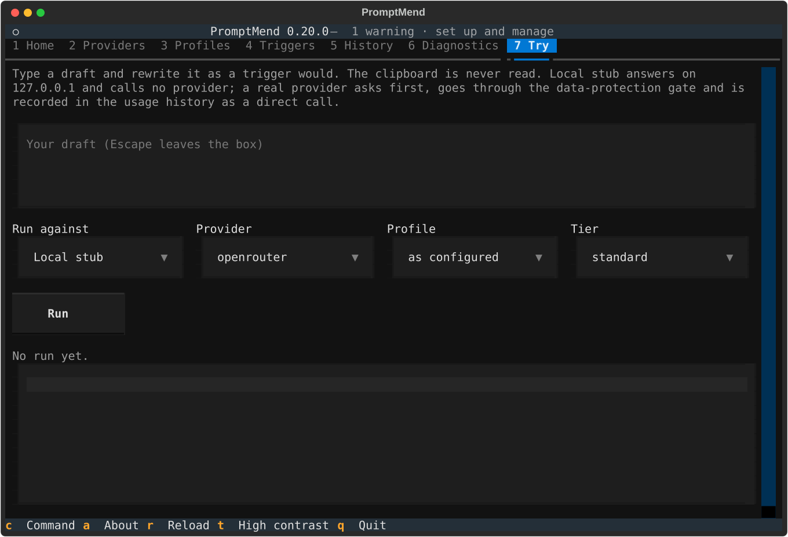

# The interface

`promptmend` opens a full-screen terminal interface for setting up and managing PromptMend:
providers and keys, profiles, the Espanso match files, the usage history, diagnostics, and a
tab to try a rewrite before a trigger pastes one. This page covers its tabs, the command line
on Home, the Try tab and the keys. Everything it does, a headless command does too (see
[Commands](commands.md)).

## Contents

- [Open it](#open-it)
- [Tabs](#tabs)
- [Home](#home)
- [Command line](#command-line)
- [Recipes and Copy last](#recipes-and-copy-last)
- [Try tab](#try-tab)
- [Keys](#keys)
- [Intro](#intro)
- [Accessibility](#accessibility)

## Open it

Run `promptmend` (or `promptmend ui`) in a terminal. Without a terminal, a bare `promptmend`
prints the help and `ui` exits 3.

The interface does what the management commands do, through the same code. Keys are shown
only as set or not set. Removing a key, deploying, detaching, migrating or deleting history
asks first, in a dialog whose Cancel has the focus. No provider is called except by the Test
call button, which runs `improve` against a stub on `127.0.0.1` with a placeholder key, and by
a Try tab run you confirm.

When it finds an earlier checkout install, it opens a "Previous install" checklist once per
session (also on Home's "Previous install…"): copy the settings, copy the profiles, deploy,
retire the old `.env`. See [From a checkout install](install.md#from-a-checkout-install).

## Tabs

| Key | Tab | What it shows and does |
|-----|-----|------------------------|
| `1` | Home | Whether you are ready, the most urgent problem, the session log and the command line |
| `2` | Providers | Each provider's settings and keys (set or not set); change a setting, set or remove a key, migrate a `.env`, run the Test call |
| `3` | Profiles | Built-in and your own profiles; pick the default profile, copy a checkout's profiles |
| `4` | Triggers | The match files and their states, the diff, deploy and detach |
| `5` | History | Usage statistics by trigger, provider, model or day; export, prune, reset |
| `6` | Diagnostics | The `doctor` checks, and an import-time check of the CLI |
| `7` | Try | Rewrite a typed draft against a stub or a confirmed provider |

Every button's tooltip shows the command that does the same in a terminal, and every result
starts with that command (`$ promptmend config set …`).

## Home

Home says in one line whether you are ready, or names the most urgent problem and the tab that
fixes it. Below, each row has a status word (ok, warn, FAIL) and the tab that fixes it:

- what `-i-` and `-ip-` run;
- the match files and Espanso;
- the usage history;
- the output mode (`PROMPT_OUTPUT`: paste or clipboard);
- the `doctor` checks.

The header shows the same status (`ok`, or `1 problem, 2 warnings`). Home also lists this
session's commands, or a few useful ones before you have done anything.

## Command line

Press `c` (from any tab) and type a command, such as `espanso status --diff`.

- It completes the word you are typing; Tab or the Right arrow takes the suggestion. It
  suggests commands, options, setting names after `config set`, key names only after
  `secrets set` or `secrets remove`, and profile names.
- It shows the command's usage and help below, or the error the CLI would print.
- Up and Down go back through what you entered. Escape leaves the line, so the tab keys work
  again.

Enter acts on the command by what it does:

| Kind | Commands | What Enter does |
|------|----------|-----------------|
| Reads, previews, changes a setting or writes an export | `doctor`, `config show\|get\|set\|unset\|validate`, `secrets status`, `profiles list`, `stats`, `espanso status`, `history export`, any `--dry-run` preview, any `--help` and `--version` | Runs it and shows `$ promptmend …`, its output and `exit N` below the line and in the session log. One runs at a time, with no input and at most 120 seconds. `doctor` skips the clipboard check unless you pass `--clipboard` |
| Asks first | `espanso deploy`, `espanso detach`, `config migrate`, `secrets set NAME`, `secrets remove`, `history prune`, `history reset` | Opens the dialog of the tab that does it (`history prune` with `--older-than` filled in; a key is typed hidden in the dialog). `--yes`, `--on-conflict`, `--no-restart` and `--preview-token` are ignored there: the dialog decides |
| Asks as it goes | `setup`, `config rollback`, `config retire`, `profiles migrate`, and a dialog's command given `--espanso-dir`, `--launcher` or `--from` | Says to quit and run it in a terminal |
| Refused | `improve`, `persona`, `ui` | Says why: the triggers run `improve` and `persona`, and `improve` reads the clipboard; the Try tab rewrites a typed draft instead |

A line that looks like it holds a key, or `secrets set` with anything after the key's name, is
never run, shown back or kept: it is cleared, and keys go in Providers. A key in a command's
output is shown as `<redacted, N chars>`.

## Recipes and Copy last

- **Recipes…** lists the useful commands Home suggests. Picking one puts it on the command
  line; nothing runs until you press Enter there, and Escape or Cancel leaves the line as it
  was.
- **Copy last** sends the session's latest command, exactly as the session log shows it
  (withheld values such as `<value withheld>` and placeholders included), to the terminal's
  clipboard (OSC 52). Some terminals, tmux or SSH sessions need it allowed, or drop it. The
  interface never reads the clipboard.

## Try tab

The Try tab (`7`) rewrites a draft you type into it, the way `-i-` would, so you can see the
result before a trigger pastes one.

1. Type the draft.
2. Pick where it runs (Local stub or Real provider), the provider, the profile and the tier.
   The profile starts at "as configured", which uses `PROMPT_PROFILE` (or `PROMPT_PRO_PROFILE`,
   if set, on the pro tier) exactly as a trigger does.
3. Press Run. One run at a time.

- **Local stub** (the default) answers on `127.0.0.1` with a placeholder key: no provider is
  called and nothing is recorded.
- **Real provider** first asks, naming the provider, model and base URL. A confirmed call may
  be charged and is recorded in the [usage history](privacy.md#usage-history) as a direct
  call (no trigger), like `promptmend improve` typed in a terminal. Home's session log shows it
  with the draft withheld.

The clipboard is never read or written, and the draft never goes into a command line. The
settings are read as a trigger reads them, so an invalid one stops the run with its marker.
Every run goes through the [data-protection gate](privacy.md#the-data-protection-gate): a
draft the gate blocks shows the same `[promptmend: …]` marker a trigger would paste, and
nothing is sent. A stub run is gated (and refused under `PROMPT_LOCAL_ONLY`) exactly as the
real call would be.

Under the result, a line gives the time, the requests, the tokens in and out and the cost: as
reported, `unknown` when the provider did not say, or `not applicable` for the stub and local
models, never a made-up 0.

## Keys

| Key | Action |
|-----|--------|
| `1`-`7` | Switch tabs |
| `c` | Open Home's command line |
| `a` | About: version, install channel, folders and licence |
| `r` | Reload |
| `t` | Switch to the high-contrast theme |
| `q` | Quit |
| Escape | Leave the command line or the Try tab's draft, so the tab keys work again |

## Intro

The interface opens with a short intro that stays until you press Enter (or any other key, or
click); that key does nothing else. Its last line says how to turn it off for good:
`promptmend config set PROMPT_UI_INTRO false`. `promptmend ui --no-intro` skips it once.

## Accessibility

- `t` switches to a high-contrast theme.
- `NO_COLOR` turns colour off.
- Scripts and screen readers can use the headless [commands](commands.md) instead: each tab's
  action names its command.

## See also

- [Commands](commands.md): the headless commands behind every button
- [Install](install.md#set-up): `setup`, the question-and-answer alternative
- [Troubleshooting](troubleshooting.md): what the Diagnostics checks mean
